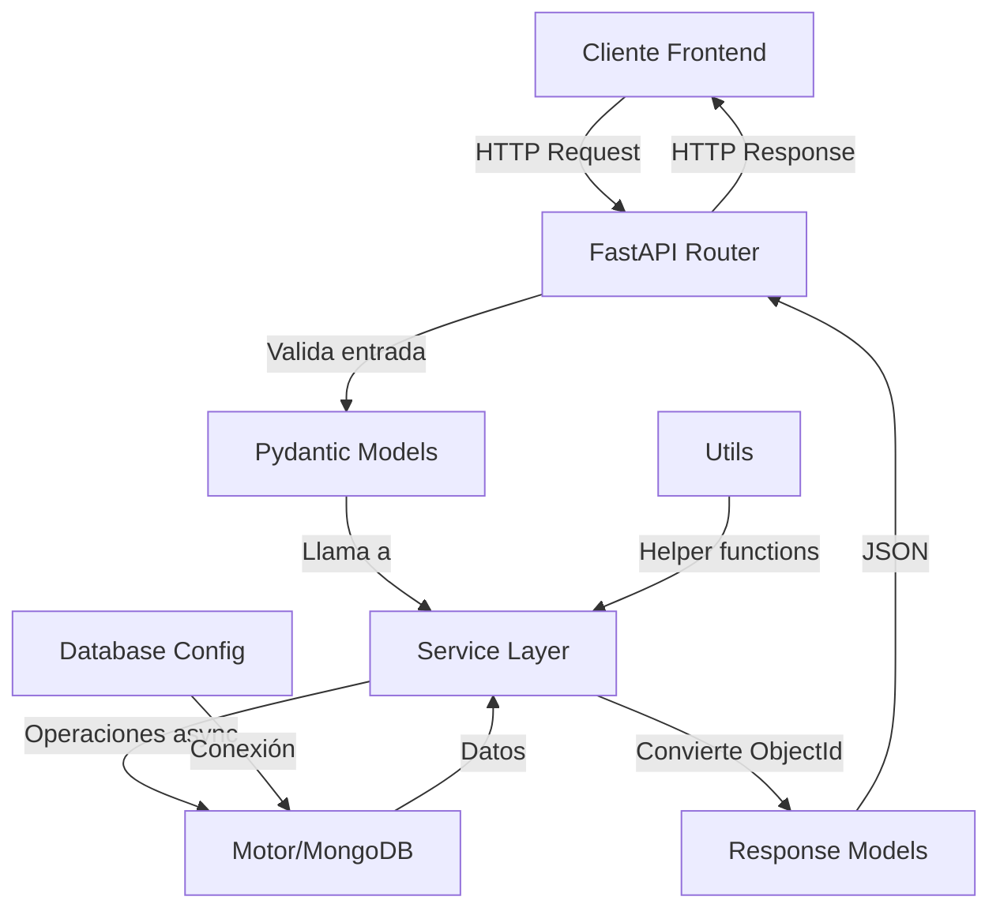
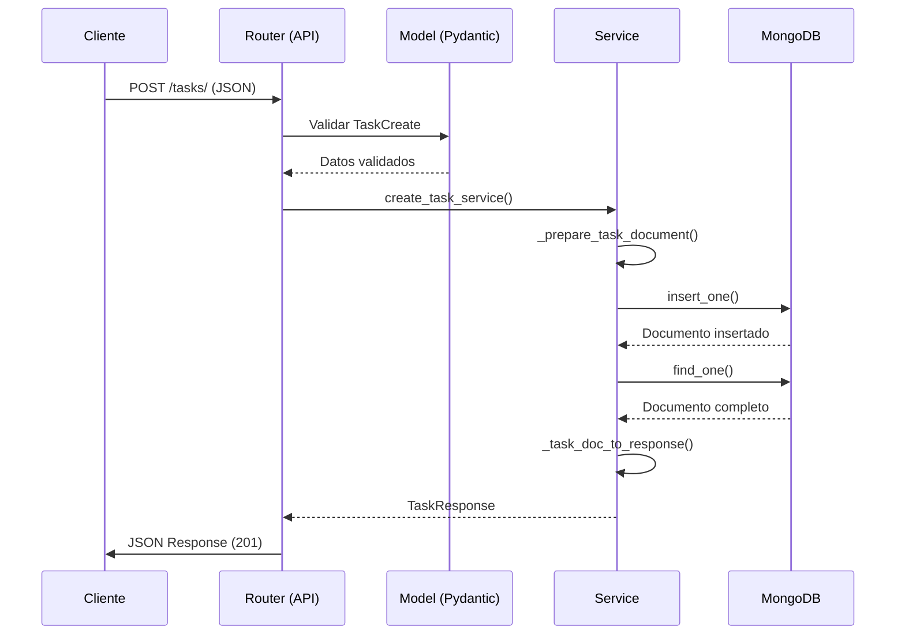

# Backend de IntelliTasker

## Descripción

Backend desarrollado con **FastAPI + Motor (MongoDB)** para la aplicación IntelliTasker. Proporciona una API REST asíncrona para la gestión de tareas y subtareas, siguiendo una arquitectura limpia con separación de responsabilidades entre rutas, servicios y modelos.

> [!IMPORTANT]
> Este backend utiliza MongoDB como única base de datos y Motor para operaciones asíncronas. Todas las operaciones de base de datos son 100% asíncronas.

## Arquitectura



## Estructura del Proyecto

```
BackEnd/
├── app/
│   ├── api/              # Rutas FastAPI
│   │   └── tasks.py
│   ├── db/               # Configuración de base de datos
│   │   └── database.py
│   ├── models/           # Modelos Pydantic
│   │   └── task.py
│   ├── services/         # Lógica de negocio
│   │   └── task_service.py
│   └── utils/            # Utilidades
│       └── ids.py
├── main.py               # Aplicación principal FastAPI
└── requirements.txt      # Dependencias Python
```

---

## Módulos Principales

### `main.py`

**Descripción**: Punto de entrada de la aplicación FastAPI. Configura la aplicación, middleware CORS, y gestiona el ciclo de vida de la conexión a MongoDB.

#### Funciones

##### `lifespan(app: FastAPI) -> AsyncContextManager`
**Descripción**: Gestiona el ciclo de vida de la aplicación FastAPI.  
**Parámetros**:
- `app`: Instancia de FastAPI.

**Retorna**: Context manager asíncrono que gestiona startup y shutdown.

**Efectos secundarios**:
- Al iniciar: conecta a MongoDB e inicializa índices.
- Al cerrar: cierra la conexión a MongoDB.

**Código y referencias**:
```python
@asynccontextmanager
async def lifespan(app: FastAPI):
    await connect_to_mongo()
    await init_indexes()
    yield
    await close_mongo_connection()
```

##### `root() -> dict`
**Descripción**: Endpoint raíz de la API que proporciona información básica.  
**Retorna**: Diccionario con mensaje, versión y ruta de documentación.

**Ruta**: `GET /`

##### `health_check() -> dict`
**Descripción**: Endpoint de verificación de salud de la API.  
**Retorna**: Diccionario con estado "healthy".

**Ruta**: `GET /health`

> [!NOTE]
> La aplicación está configurada con CORS para permitir conexiones desde `http://localhost:5173` (Vite) y `http://localhost:3000` (otros servidores de desarrollo).

---

### `app/db/database.py`

**Descripción**: Módulo de configuración y gestión de la conexión a MongoDB usando Motor (AsyncIOMotorClient).

#### Variables Globales

- `client: Optional[AsyncIOMotorClient]`: Cliente global de MongoDB.
- `db`: Instancia de la base de datos.
- `MONGODB_URL`: URL de conexión (por defecto: `mongodb://localhost:27017`).
- `DATABASE_NAME`: Nombre de la base de datos (por defecto: `intellitasker`).

#### Funciones

##### `connect_to_mongo() -> None`
**Descripción**: Establece la conexión a MongoDB y verifica que esté disponible.  
**Retorna**: None.

**Lanza**:
- `Exception`: Si no se puede conectar a MongoDB o el servidor no responde.

**Efectos secundarios**:
- Crea una instancia global de `AsyncIOMotorClient`.
- Configura el cliente con timeout de 5 segundos.
- Verifica la conexión mediante un comando `ping`.

**Código y referencias**:
```python
async def connect_to_mongo():
    client = AsyncIOMotorClient(
        MONGODB_URL,
        uuidRepresentation="standard",
        serverSelectionTimeoutMS=5000
    )
    db = client[DATABASE_NAME]
    await client.admin.command('ping')
```

##### `close_mongo_connection() -> None`
**Descripción**: Cierra la conexión a MongoDB de forma segura.  
**Retorna**: None.

**Efectos secundarios**:
- Cierra el cliente de MongoDB si existe.

> [!WARNING]
> Es importante cerrar la conexión al finalizar la aplicación para liberar recursos correctamente.

---

### `app/utils/ids.py`

**Descripción**: Utilidades para el manejo seguro de ObjectId de MongoDB. Proporciona funciones para validar y convertir ObjectId, evitando exponer IDs crudos en la API.

#### Funciones

##### `validate_object_id(id_str: str) -> ObjectId`
**Descripción**: Valida y convierte un string a ObjectId de MongoDB.  
**Parámetros**:
- `id_str`: String que representa un ObjectId.

**Retorna**: ObjectId válido.

**Lanza**:
- `ValueError`: Si el formato del ObjectId es inválido.

**Código y referencias**:
```python
def validate_object_id(id_str: str) -> ObjectId:
    if not ObjectId.is_valid(id_str):
        raise ValueError(f"Formato de ObjectId inválido: {id_str}")
    return ObjectId(id_str)
```

##### `object_id_to_str(doc: dict) -> dict`
**Descripción**: Convierte el campo `_id` de ObjectId a string en un documento de MongoDB.  
**Parámetros**:
- `doc`: Diccionario con un campo `_id` de tipo ObjectId.

**Retorna**: Diccionario con el campo `_id` convertido a string como `id`.

**Efectos secundarios**:
- Modifica el diccionario original, eliminando `_id` y añadiendo `id`.

> [!IMPORTANT]
> Esta función es crítica para mantener la consistencia en las respuestas de la API. Nunca se deben exponer ObjectId crudos al cliente.

---

### `app/models/task.py`

**Descripción**: Modelos Pydantic para validación y serialización de tareas y subtareas. Define los esquemas de entrada (Create/Update) y salida (Response) para la API.

#### Clases

##### `SubtaskCreate`
**Descripción**: Modelo para crear una subtarea.  
**Campos**:
- `title: str`: Título de la subtarea (1-200 caracteres).
- `estimatedHours: float`: Horas estimadas (debe ser > 0).
- `completed: bool`: Estado de completado (por defecto: False).

##### `SubtaskResponse`
**Descripción**: Modelo de respuesta para una subtarea.  
**Campos**:
- `id: str`: ID único de la subtarea.
- `title: str`: Título de la subtarea.
- `estimatedHours: float`: Horas estimadas.
- `completed: bool`: Estado de completado.

##### `TaskCreate`
**Descripción**: Modelo para crear una tarea con validaciones.  
**Campos**:
- `title: str`: Título de la tarea (1-200 caracteres).
- `description: str`: Descripción (máximo 1000 caracteres, por defecto: "").
- `startDateTime: str`: Fecha/hora de inicio en formato ISO 8601.
- `endDateTime: str`: Fecha/hora de fin en formato ISO 8601.
- `estimatedHours: float`: Horas estimadas (debe ser > 0).
- `completed: bool`: Estado de completado (por defecto: False).
- `subtasks: List[SubtaskCreate]`: Lista de subtareas (por defecto: lista vacía).

**Validaciones**:
- `endDateTime` debe ser posterior a `startDateTime` (validación personalizada).

**Lanza**:
- `ValueError`: Si `endDateTime` no es posterior a `startDateTime`.

##### `TaskUpdate`
**Descripción**: Modelo para actualizar una tarea. Todos los campos son opcionales.  
**Campos**: Mismos que `TaskCreate`, pero todos opcionales (`Optional[...]`).

> [!TIP]
> Al actualizar, solo se modifican los campos que se envían. Los campos no incluidos permanecen sin cambios.

##### `TaskResponse`
**Descripción**: Modelo de respuesta completo para una tarea.  
**Campos**:
- `id: str`: ID único de la tarea.
- `title: str`: Título de la tarea.
- `description: str`: Descripción.
- `startDateTime: str`: Fecha/hora de inicio en formato ISO 8601.
- `endDateTime: str`: Fecha/hora de fin en formato ISO 8601.
- `estimatedHours: float`: Horas estimadas.
- `completed: bool`: Estado de completado.
- `subtasks: List[SubtaskResponse]`: Lista de subtareas.
- `created_at: str`: Fecha de creación en formato ISO 8601.
- `updated_at: str`: Fecha de última actualización en formato ISO 8601.

> [!NOTE]
> Todas las fechas se almacenan en UTC y se devuelven en formato ISO 8601 para garantizar compatibilidad con el frontend.

---

### `app/services/task_service.py`

**Descripción**: Servicio de lógica de negocio para tareas. Contiene toda la lógica de acceso a la base de datos y validaciones de negocio. Es la única capa que interactúa directamente con MongoDB.

#### Funciones

##### `init_indexes() -> None`
**Descripción**: Inicializa los índices de la colección de tareas para optimizar consultas.  
**Retorna**: None.

**Efectos secundarios**:
- Crea índices en los campos: `created_at`, `completed`, `startDateTime`.

> [!IMPORTANT]
> Esta función debe ejecutarse al iniciar la aplicación para garantizar un rendimiento óptimo en las consultas.

##### `_prepare_task_document(task_data: dict) -> dict`
**Descripción**: Prepara un documento de tarea para insertar en MongoDB. Convierte fechas a datetime UTC y añade timestamps.  
**Parámetros**:
- `task_data`: Diccionario con los datos de la tarea.

**Retorna**: Diccionario preparado para MongoDB con fechas en formato datetime UTC.

**Lanza**:
- `ValueError`: Si `endDateTime` no es posterior a `startDateTime`.

**Efectos secundarios**:
- Genera ObjectId para cada subtarea.

##### `_task_doc_to_response(doc: dict) -> TaskResponse`
**Descripción**: Convierte un documento de MongoDB a `TaskResponse`.  
**Parámetros**:
- `doc`: Documento de MongoDB con `_id` como ObjectId.

**Retorna**: Instancia de `TaskResponse` con todos los campos convertidos correctamente.

**Efectos secundarios**:
- Convierte ObjectId a strings.
- Convierte datetime a strings ISO 8601.

##### `create_task_service(task_data: TaskCreate) -> Optional[TaskResponse]`
**Descripción**: Crea una nueva tarea en la base de datos.  
**Parámetros**:
- `task_data`: Datos de la tarea a crear.

**Retorna**: `TaskResponse` con la tarea creada o `None` si falla.

**Lanza**:
- Logs de error si ocurre una excepción.

**Código y referencias**:
```python
async def create_task_service(task_data: TaskCreate) -> Optional[TaskResponse]:
    document = _prepare_task_document(task_data.model_dump())
    result = await db.tasks.insert_one(document)
    created_doc = await db.tasks.find_one({"_id": result.inserted_id})
    return _task_doc_to_response(created_doc)
```

##### `get_task_by_id_service(task_id: str) -> Optional[TaskResponse]`
**Descripción**: Obtiene una tarea por su ID.  
**Parámetros**:
- `task_id`: ID de la tarea (string).

**Retorna**: `TaskResponse` con la tarea o `None` si no se encuentra.

**Lanza**:
- Logs de advertencia si el ObjectId es inválido.

##### `get_all_tasks_service(completed: Optional[bool] = None, skip: int = 0, limit: int = 100) -> List[TaskResponse]`
**Descripción**: Obtiene todas las tareas con filtros opcionales y paginación.  
**Parámetros**:
- `completed`: Filtrar por estado de completado (opcional).
- `skip`: Número de documentos a saltar (por defecto: 0).
- `limit`: Número máximo de documentos a retornar (por defecto: 100).

**Retorna**: Lista de `TaskResponse`.

**Efectos secundarios**:
- Ordena los resultados por `created_at` descendente.

##### `update_task_service(task_id: str, task_update: TaskUpdate) -> Optional[TaskResponse]`
**Descripción**: Actualiza una tarea existente. Solo actualiza los campos proporcionados.  
**Parámetros**:
- `task_id`: ID de la tarea a actualizar.
- `task_update`: Datos a actualizar (solo campos modificados).

**Retorna**: `TaskResponse` con la tarea actualizada o `None` si no se encuentra.

**Lanza**:
- `ValueError`: Si las fechas actualizadas no son válidas (endDateTime <= startDateTime).

**Efectos secundarios**:
- Actualiza el campo `updated_at` automáticamente.

> [!WARNING]
> Al actualizar subtareas, se reemplazan todas las subtareas existentes. Si solo quieres actualizar una subtarea específica, debes incluir todas las subtareas en la actualización.

##### `delete_task_service(task_id: str) -> bool`
**Descripción**: Elimina una tarea de la base de datos.  
**Parámetros**:
- `task_id`: ID de la tarea a eliminar.

**Retorna**: `True` si se eliminó correctamente, `False` si no se encontró.

---

### `app/api/tasks.py`

**Descripción**: Rutas FastAPI para la gestión de tareas. Esta capa solo se encarga de validar entrada, llamar a servicios y formatear respuestas. No contiene lógica de negocio.

#### Router

- **Prefijo**: `/tasks`
- **Tags**: `["tasks"]` (para documentación Swagger)

#### Endpoints

##### `POST /tasks/`
**Descripción**: Crea una nueva tarea.  
**Parámetros**:
- `payload: TaskCreate`: Datos de la tarea a crear (body).

**Retorna**: `TaskResponse` con la tarea creada (status 201).

**Lanza**:
- `HTTPException` (400): Si no se pudo crear la tarea.

##### `GET /tasks/{task_id}`
**Descripción**: Obtiene una tarea por su ID.  
**Parámetros**:
- `task_id: str`: ID de la tarea (path parameter).

**Retorna**: `TaskResponse` con la tarea (status 200).

**Lanza**:
- `HTTPException` (404): Si la tarea no se encuentra.

##### `GET /tasks/`
**Descripción**: Obtiene todas las tareas con filtros opcionales y paginación.  
**Query Parameters**:
- `completed: Optional[bool]`: Filtrar por estado de completado.
- `skip: int`: Número de documentos a saltar (mínimo: 0).
- `limit: int`: Número máximo de documentos (mínimo: 1, máximo: 1000).

**Retorna**: Lista de `TaskResponse` (status 200).

##### `PUT /tasks/{task_id}`
**Descripción**: Actualiza una tarea existente.  
**Parámetros**:
- `task_id: str`: ID de la tarea a actualizar (path parameter).
- `payload: TaskUpdate`: Datos a actualizar (body).

**Retorna**: `TaskResponse` con la tarea actualizada (status 200).

**Lanza**:
- `HTTPException` (404): Si la tarea no se encuentra o los datos son inválidos.

##### `DELETE /tasks/{task_id}`
**Descripción**: Elimina una tarea.  
**Parámetros**:
- `task_id: str`: ID de la tarea a eliminar (path parameter).

**Retorna**: Sin contenido (status 204).

**Lanza**:
- `HTTPException` (404): Si la tarea no se encuentra.

> [!TIP]
> Puedes probar todos los endpoints usando la documentación interactiva de Swagger en `/docs` cuando el servidor esté ejecutándose.

---

## Flujo de Datos



---

## Configuración y Despliegue

### Requisitos Previos

- Python 3.10 o superior
- MongoDB instalado y ejecutándose localmente (puerto 27017 por defecto)

### Instalación

1. Crear entorno virtual:
```bash
python -m venv venv
source venv/bin/activate  # En Windows: venv\Scripts\activate
```

2. Instalar dependencias:
```bash
pip install -r requirements.txt
```

3. Verificar que MongoDB esté ejecutándose:
```bash
# En Linux/Mac
sudo systemctl start mongod

# O ejecutar manualmente
mongod
```

4. Ejecutar el servidor:
```bash
uvicorn main:app --reload --host 0.0.0.0 --port 8000
```

### Variables de Entorno

Puedes configurar la conexión a MongoDB modificando las variables en `app/db/database.py`:

- `MONGODB_URL`: URL de conexión (por defecto: `mongodb://localhost:27017`)
- `DATABASE_NAME`: Nombre de la base de datos (por defecto: `intellitasker`)

> [!NOTE]
> En producción, se recomienda usar variables de entorno o un archivo `.env` para la configuración.

---

## Documentación Interactiva

Una vez que el servidor esté ejecutándose, puedes acceder a:

- **Swagger UI**: http://localhost:8000/docs
- **ReDoc**: http://localhost:8000/redoc

---

## Principios de Diseño

### Separación de Responsabilidades

- **Rutas (`app/api/`)**: Solo validan entrada y formatean salida.
- **Servicios (`app/services/`)**: Contienen toda la lógica de negocio y acceso a datos.
- **Modelos (`app/models/`)**: Definen esquemas de validación y serialización.

### Operaciones Asíncronas

Todas las operaciones de base de datos son asíncronas usando `async/await` y Motor.

### Manejo de ObjectId

- Los ObjectId nunca se exponen directamente al cliente.
- Se convierten automáticamente a strings en las respuestas.
- Se validan antes de realizar consultas.

### Validaciones

- Validación de tipos mediante Pydantic.
- Validación de fechas (endDateTime > startDateTime).
- Validación de rangos (horas estimadas > 0).
- Validación de formatos (ObjectId, fechas ISO 8601).

---

## Referencias

- [FastAPI Documentation](https://fastapi.tiangolo.com/)
- [Motor (MongoDB Async Driver)](https://motor.readthedocs.io/)
- [Pydantic Documentation](https://docs.pydantic.dev/)
- [MongoDB Documentation](https://www.mongodb.com/docs/)

---

## Licencia

Este documento está bajo la licencia [Creative Commons Attribution-NonCommercial-NoDerivatives 4.0 International](https://creativecommons.org/licenses/by-nc/4.0/deed.en).

