# Backend de IntelliTasker

## Descripción

Backend desarrollado con **FastAPI + Motor (MongoDB)** para la aplicación IntelliTasker. Proporciona una API REST asíncrona para la gestión de tareas y subtareas, siguiendo una arquitectura limpia con separación de responsabilidades entre rutas, servicios y modelos.

> [!IMPORTANT]
> Este backend utiliza MongoDB como única base de datos y Motor para operaciones asíncronas. Todas las operaciones de base de datos son 100% asíncronas.

## Arquitectura

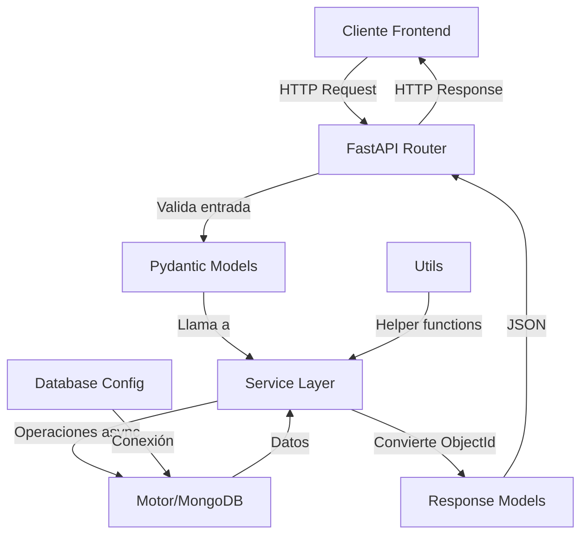
```mermaid
graph TD
    A[Cliente Frontend] -->|HTTP Request| B[FastAPI Router]
    B -->|Valida entrada| C[Pydantic Models]
    C -->|Llama a| D[Service Layer]
    D -->|Operaciones async| E[Motor/MongoDB]
    E -->|Datos| D
    D -->|Convierte ObjectId| F[Response Models]
    F -->|JSON| B
    B -->|HTTP Response| A
    
    G[Utils] -->|Helper functions| D
    H[Database Config] -->|Conexión| E
```

## Estructura del Proyecto

```
BackEnd/
├── app/
│   ├── api/              # Rutas FastAPI
│   │   └── tasks.py
│   ├── db/               # Configuración de base de datos
│   │   └── database.py
│   ├── models/           # Modelos Pydantic
│   │   └── task.py
│   ├── services/         # Lógica de negocio
│   │   └── task_service.py
│   └── utils/            # Utilidades
│       └── ids.py
├── main.py               # Aplicación principal FastAPI
└── requirements.txt      # Dependencias Python
```

---

## Módulos Principales

### `main.py`

**Descripción**: Punto de entrada de la aplicación FastAPI. Configura la aplicación, middleware CORS, y gestiona el ciclo de vida de la conexión a MongoDB.

#### Funciones

##### `lifespan(app: FastAPI) -> AsyncContextManager`
**Descripción**: Gestiona el ciclo de vida de la aplicación FastAPI.  
**Parámetros**:
- `app`: Instancia de FastAPI.

**Retorna**: Context manager asíncrono que gestiona startup y shutdown.

**Efectos secundarios**:
- Al iniciar: conecta a MongoDB e inicializa índices.
- Al cerrar: cierra la conexión a MongoDB.

**Código y referencias**:
```python
@asynccontextmanager
async def lifespan(app: FastAPI):
    await connect_to_mongo()
    await init_indexes()
    yield
    await close_mongo_connection()
```

**Diagrama de flujo**:

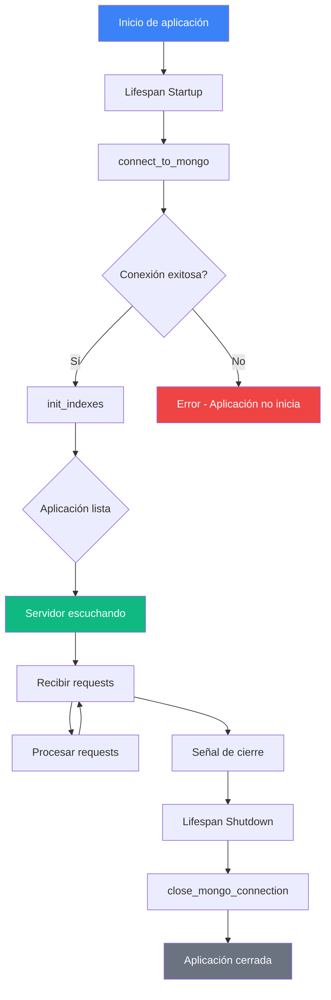
```mermaid
flowchart TD
    A[Inicio de aplicación] --> B[Lifespan Startup]
    B --> C[connect_to_mongo]
    C --> D{Conexión exitosa?}
    D -->|Sí| E[init_indexes]
    D -->|No| F[Error - Aplicación no inicia]
    E --> G{Aplicación lista}
    G --> H[Servidor escuchando]
    H --> I[Recibir requests]
    I --> J[Procesar requests]
    J --> I
    I --> K[Señal de cierre]
    K --> L[Lifespan Shutdown]
    L --> M[close_mongo_connection]
    M --> N[Aplicación cerrada]
    
    style A fill:#3b82f6,color:#fff
    style H fill:#10b981,color:#fff
    style F fill:#ef4444,color:#fff
    style N fill:#6b7280,color:#fff
```

##### `root() -> dict`
**Descripción**: Endpoint raíz de la API que proporciona información básica.  
**Retorna**: Diccionario con mensaje, versión y ruta de documentación.

**Ruta**: `GET /`

##### `health_check() -> dict`
**Descripción**: Endpoint de verificación de salud de la API.  
**Retorna**: Diccionario con estado "healthy".

**Ruta**: `GET /health`

> [!NOTE]
> La aplicación está configurada con CORS para permitir conexiones desde `http://localhost:5173` (Vite) y `http://localhost:3000` (otros servidores de desarrollo).

---

### `app/db/database.py`

**Descripción**: Módulo de configuración y gestión de la conexión a MongoDB usando Motor (AsyncIOMotorClient).

#### Variables Globales

- `client: Optional[AsyncIOMotorClient]`: Cliente global de MongoDB.
- `db`: Instancia de la base de datos.
- `db_settings: DatabaseSettings`: Configuración de la base de datos cargada desde `.env`.

#### Clases

##### `DatabaseSettings`
**Descripción**: Configuración de la base de datos usando Pydantic Settings.  
**Campos**:
- `mongodb_url: str`: URL de conexión (por defecto: `mongodb://localhost:27017`).
- `database_name: str`: Nombre de la base de datos (por defecto: `intellitasker`).

**Configuración**:
- Lee variables de entorno desde el archivo `.env`.

#### Funciones

##### `connect_to_mongo() -> None`
**Descripción**: Establece la conexión a MongoDB y verifica que esté disponible.  
**Retorna**: None.

**Lanza**:
- `Exception`: Si no se puede conectar a MongoDB o el servidor no responde.

**Efectos secundarios**:
- Crea una instancia global de `AsyncIOMotorClient`.
- Configura el cliente con timeout de 5 segundos.
- Verifica la conexión mediante un comando `ping`.

**Código y referencias**:
```python
async def connect_to_mongo():
    client = AsyncIOMotorClient(
        db_settings.mongodb_url,
        uuidRepresentation="standard",
        serverSelectionTimeoutMS=5000
    )
    db = client[db_settings.database_name]
    await client.admin.command('ping')
```

**Diagrama de flujo**:

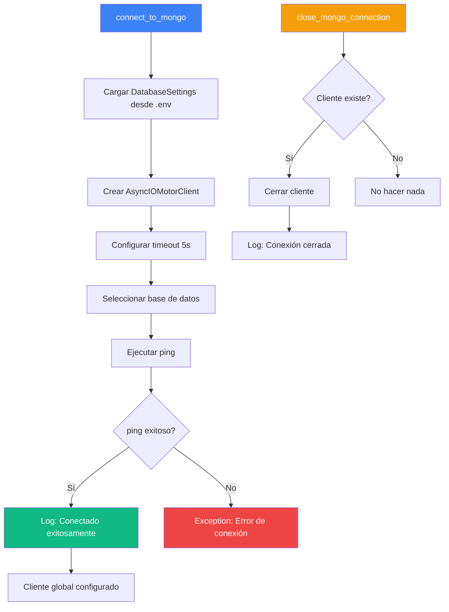
```mermaid
flowchart TD
    A[connect_to_mongo] --> B[Cargar DatabaseSettings desde .env]
    B --> C[Crear AsyncIOMotorClient]
    C --> D[Configurar timeout 5s]
    D --> E[Seleccionar base de datos]
    E --> F[Ejecutar ping]
    F --> G{ping exitoso?}
    G -->|Sí| H[Log: Conectado exitosamente]
    G -->|No| I[Exception: Error de conexión]
    H --> J[Cliente global configurado]
    
    K[close_mongo_connection] --> L{Cliente existe?}
    L -->|Sí| M[Cerrar cliente]
    L -->|No| N[No hacer nada]
    M --> O[Log: Conexión cerrada]
    
    style A fill:#3b82f6,color:#fff
    style H fill:#10b981,color:#fff
    style I fill:#ef4444,color:#fff
    style K fill:#f59e0b,color:#fff
```

##### `close_mongo_connection() -> None`
**Descripción**: Cierra la conexión a MongoDB de forma segura.  
**Retorna**: None.

**Efectos secundarios**:
- Cierra el cliente de MongoDB si existe.

> [!WARNING]
> Es importante cerrar la conexión al finalizar la aplicación para liberar recursos correctamente.

---

### `app/utils/ids.py`

**Descripción**: Utilidades para el manejo seguro de ObjectId de MongoDB. Proporciona funciones para validar y convertir ObjectId, evitando exponer IDs crudos en la API.

#### Funciones

##### `validate_object_id(id_str: str) -> ObjectId`
**Descripción**: Valida y convierte un string a ObjectId de MongoDB.  
**Parámetros**:
- `id_str`: String que representa un ObjectId.

**Retorna**: ObjectId válido.

**Lanza**:
- `ValueError`: Si el formato del ObjectId es inválido.

**Código y referencias**:
```python
def validate_object_id(id_str: str) -> ObjectId:
    if not ObjectId.is_valid(id_str):
        raise ValueError(f"Formato de ObjectId inválido: {id_str}")
    return ObjectId(id_str)
```

**Diagrama de flujo**:

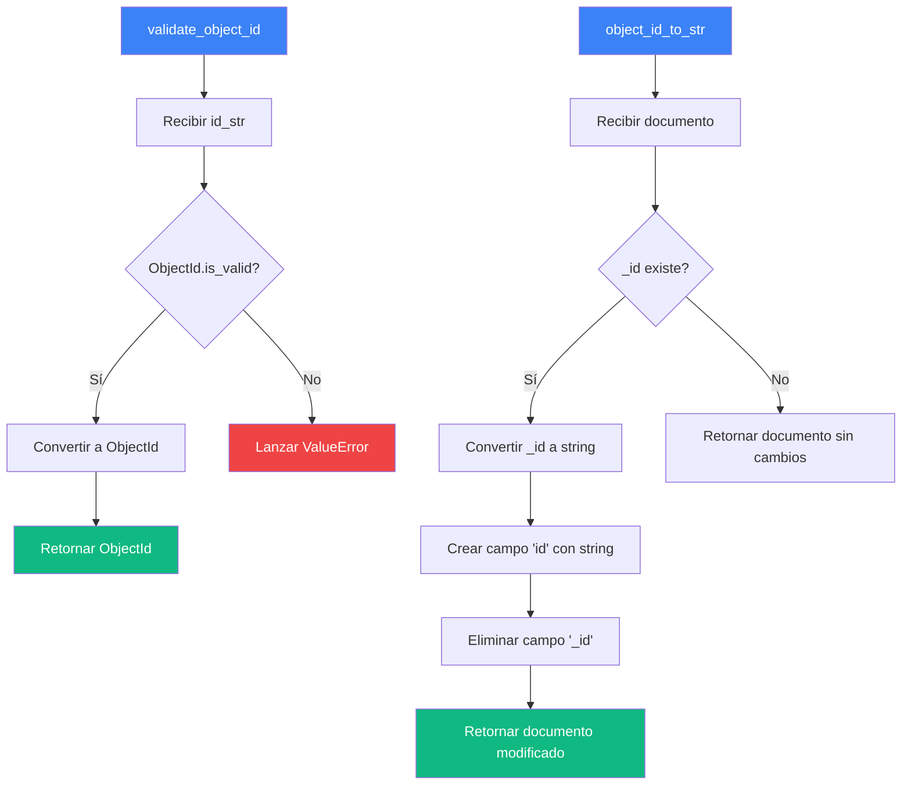
```mermaid
flowchart TD
    A[validate_object_id] --> B[Recibir id_str]
    B --> C{ObjectId.is_valid?}
    C -->|Sí| D[Convertir a ObjectId]
    C -->|No| E[Lanzar ValueError]
    D --> F[Retornar ObjectId]
    
    G[object_id_to_str] --> H[Recibir documento]
    H --> I{_id existe?}
    I -->|Sí| J[Convertir _id a string]
    I -->|No| K[Retornar documento sin cambios]
    J --> L[Crear campo 'id' con string]
    L --> M[Eliminar campo '_id']
    M --> N[Retornar documento modificado]
    
    style A fill:#3b82f6,color:#fff
    style E fill:#ef4444,color:#fff
    style F fill:#10b981,color:#fff
    style G fill:#3b82f6,color:#fff
    style N fill:#10b981,color:#fff
```

##### `object_id_to_str(doc: dict) -> dict`
**Descripción**: Convierte el campo `_id` de ObjectId a string en un documento de MongoDB.  
**Parámetros**:
- `doc`: Diccionario con un campo `_id` de tipo ObjectId.

**Retorna**: Diccionario con el campo `_id` convertido a string como `id`.

**Efectos secundarios**:
- Modifica el diccionario original, eliminando `_id` y añadiendo `id`.

> [!IMPORTANT]
> Esta función es crítica para mantener la consistencia en las respuestas de la API. Nunca se deben exponer ObjectId crudos al cliente.

---

### `app/models/task.py`

**Descripción**: Modelos Pydantic para validación y serialización de tareas y subtareas. Define los esquemas de entrada (Create/Update) y salida (Response) para la API.

#### Clases

##### `SubtaskCreate`
**Descripción**: Modelo para crear una subtarea.  
**Campos**:
- `title: str`: Título de la subtarea (1-200 caracteres).
- `estimatedHours: float`: Horas estimadas (debe ser > 0).
- `completed: bool`: Estado de completado (por defecto: False).

##### `SubtaskResponse`
**Descripción**: Modelo de respuesta para una subtarea.  
**Campos**:
- `id: str`: ID único de la subtarea.
- `title: str`: Título de la subtarea.
- `estimatedHours: float`: Horas estimadas.
- `completed: bool`: Estado de completado.

##### `TaskCreate`
**Descripción**: Modelo para crear una tarea con validaciones.  
**Campos**:
- `title: str`: Título de la tarea (1-200 caracteres).
- `description: str`: Descripción (máximo 1000 caracteres, por defecto: "").
- `startDateTime: str`: Fecha/hora de inicio en formato ISO 8601.
- `endDateTime: str`: Fecha/hora de fin en formato ISO 8601.
- `estimatedHours: float`: Horas estimadas (debe ser > 0).
- `completed: bool`: Estado de completado (por defecto: False).
- `subtasks: List[SubtaskCreate]`: Lista de subtareas (por defecto: lista vacía).

**Validaciones**:
- `endDateTime` debe ser posterior a `startDateTime` (validación personalizada).

**Lanza**:
- `ValueError`: Si `endDateTime` no es posterior a `startDateTime`.

##### `TaskUpdate`
**Descripción**: Modelo para actualizar una tarea. Todos los campos son opcionales.  
**Campos**: Mismos que `TaskCreate`, pero todos opcionales (`Optional[...]`).

> [!TIP]
> Al actualizar, solo se modifican los campos que se envían. Los campos no incluidos permanecen sin cambios.

##### `TaskResponse`
**Descripción**: Modelo de respuesta completo para una tarea.  
**Campos**:
- `id: str`: ID único de la tarea.
- `title: str`: Título de la tarea.
- `description: str`: Descripción.
- `startDateTime: str`: Fecha/hora de inicio en formato ISO 8601.
- `endDateTime: str`: Fecha/hora de fin en formato ISO 8601.
- `estimatedHours: float`: Horas estimadas.
- `completed: bool`: Estado de completado.
- `subtasks: List[SubtaskResponse]`: Lista de subtareas.
- `created_at: str`: Fecha de creación en formato ISO 8601.
- `updated_at: str`: Fecha de última actualización en formato ISO 8601.

> [!NOTE]
> Todas las fechas se almacenan en UTC y se devuelven en formato ISO 8601 para garantizar compatibilidad con el frontend.

---

### `app/services/task_service.py`

**Descripción**: Servicio de lógica de negocio para tareas. Contiene toda la lógica de acceso a la base de datos y validaciones de negocio. Es la única capa que interactúa directamente con MongoDB.

#### Funciones

##### `init_indexes() -> None`
**Descripción**: Inicializa los índices de la colección de tareas para optimizar consultas.  
**Retorna**: None.

**Efectos secundarios**:
- Crea índices en los campos: `created_at`, `completed`, `startDateTime`.

> [!IMPORTANT]
> Esta función debe ejecutarse al iniciar la aplicación para garantizar un rendimiento óptimo en las consultas.

**Diagrama de flujo**:

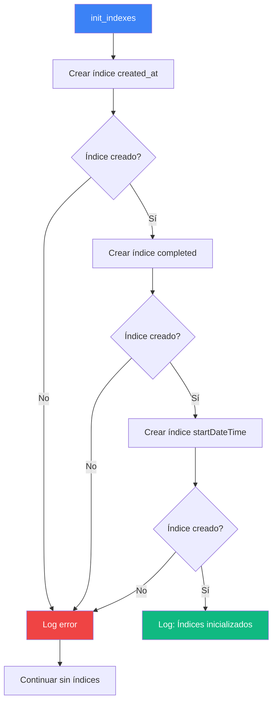
```mermaid
flowchart TD
    A[init_indexes] --> B[Crear índice created_at]
    B --> C{Índice creado?}
    C -->|Sí| D[Crear índice completed]
    C -->|No| E[Log error]
    D --> F{Índice creado?}
    F -->|Sí| G[Crear índice startDateTime]
    F -->|No| E
    G --> H{Índice creado?}
    H -->|Sí| I[Log: Índices inicializados]
    H -->|No| E
    E --> J[Continuar sin índices]
    
    style A fill:#3b82f6,color:#fff
    style I fill:#10b981,color:#fff
    style E fill:#ef4444,color:#fff
```

##### `_prepare_task_document(task_data: dict) -> dict`
**Descripción**: Prepara un documento de tarea para insertar en MongoDB. Convierte fechas a datetime UTC y añade timestamps.  
**Parámetros**:
- `task_data`: Diccionario con los datos de la tarea.

**Retorna**: Diccionario preparado para MongoDB con fechas en formato datetime UTC.

**Lanza**:
- `ValueError`: Si `endDateTime` no es posterior a `startDateTime`.

**Efectos secundarios**:
- Genera ObjectId para cada subtarea.

**Diagrama de flujo**:

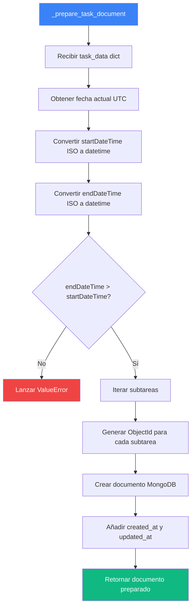
```mermaid
flowchart TD
    A[_prepare_task_document] --> B[Recibir task_data dict]
    B --> C[Obtener fecha actual UTC]
    C --> D[Convertir startDateTime ISO a datetime]
    D --> E[Convertir endDateTime ISO a datetime]
    E --> F{endDateTime > startDateTime?}
    F -->|No| G[Lanzar ValueError]
    F -->|Sí| H[Iterar subtareas]
    H --> I[Generar ObjectId para cada subtarea]
    I --> J[Crear documento MongoDB]
    J --> K[Añadir created_at y updated_at]
    K --> L[Retornar documento preparado]
    
    style A fill:#3b82f6,color:#fff
    style L fill:#10b981,color:#fff
    style G fill:#ef4444,color:#fff
```

##### `_task_doc_to_response(doc: dict) -> TaskResponse`
**Descripción**: Convierte un documento de MongoDB a `TaskResponse`.  
**Parámetros**:
- `doc`: Documento de MongoDB con `_id` como ObjectId.

**Retorna**: Instancia de `TaskResponse` con todos los campos convertidos correctamente.

**Efectos secundarios**:
- Convierte ObjectId a strings.
- Convierte datetime a strings ISO 8601.

**Diagrama de flujo**:

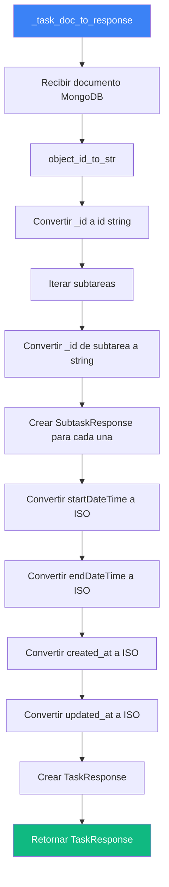
```mermaid
flowchart TD
    A[_task_doc_to_response] --> B[Recibir documento MongoDB]
    B --> C[object_id_to_str]
    C --> D[Convertir _id a id string]
    D --> E[Iterar subtareas]
    E --> F[Convertir _id de subtarea a string]
    F --> G[Crear SubtaskResponse para cada una]
    G --> H[Convertir startDateTime a ISO]
    H --> I[Convertir endDateTime a ISO]
    I --> J[Convertir created_at a ISO]
    J --> K[Convertir updated_at a ISO]
    K --> L[Crear TaskResponse]
    L --> M[Retornar TaskResponse]
    
    style A fill:#3b82f6,color:#fff
    style M fill:#10b981,color:#fff
```

##### `create_task_service(task_data: TaskCreate) -> Optional[TaskResponse]`
**Descripción**: Crea una nueva tarea en la base de datos.  
**Parámetros**:
- `task_data`: Datos de la tarea a crear.

**Retorna**: `TaskResponse` con la tarea creada o `None` si falla.

**Lanza**:
- Logs de error si ocurre una excepción.

**Código y referencias**:
```python
async def create_task_service(task_data: TaskCreate) -> Optional[TaskResponse]:
    document = _prepare_task_document(task_data.model_dump())
    result = await db.tasks.insert_one(document)
    created_doc = await db.tasks.find_one({"_id": result.inserted_id})
    return _task_doc_to_response(created_doc)
```

**Diagrama de flujo**:

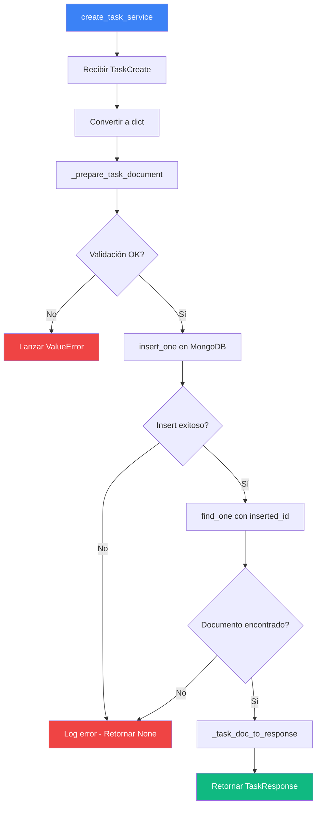
```mermaid
flowchart TD
    A[create_task_service] --> B[Recibir TaskCreate]
    B --> C[Convertir a dict]
    C --> D[_prepare_task_document]
    D --> E{Validación OK?}
    E -->|No| F[Lanzar ValueError]
    E -->|Sí| G[insert_one en MongoDB]
    G --> H{Insert exitoso?}
    H -->|No| I[Log error - Retornar None]
    H -->|Sí| J[find_one con inserted_id]
    J --> K{Documento encontrado?}
    K -->|No| I
    K -->|Sí| L[_task_doc_to_response]
    L --> M[Retornar TaskResponse]
    
    style A fill:#3b82f6,color:#fff
    style M fill:#10b981,color:#fff
    style F fill:#ef4444,color:#fff
    style I fill:#ef4444,color:#fff
```

##### `get_task_by_id_service(task_id: str) -> Optional[TaskResponse]`
**Descripción**: Obtiene una tarea por su ID.  
**Parámetros**:
- `task_id`: ID de la tarea (string).

**Retorna**: `TaskResponse` con la tarea o `None` si no se encuentra.

**Lanza**:
- Logs de advertencia si el ObjectId es inválido.

**Diagrama de flujo**:

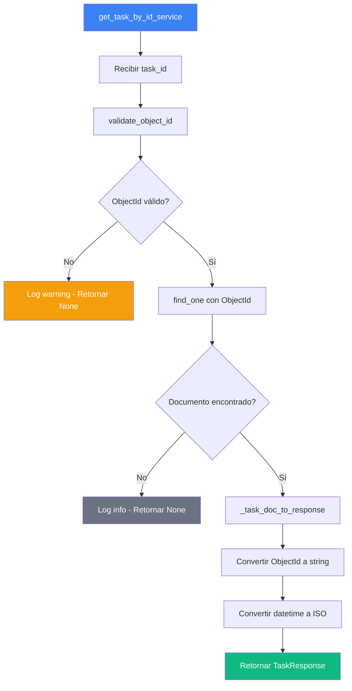
```mermaid
flowchart TD
    A[get_task_by_id_service] --> B[Recibir task_id]
    B --> C[validate_object_id]
    C --> D{ObjectId válido?}
    D -->|No| E[Log warning - Retornar None]
    D -->|Sí| F[find_one con ObjectId]
    F --> G{Documento encontrado?}
    G -->|No| H[Log info - Retornar None]
    G -->|Sí| I[_task_doc_to_response]
    I --> J[Convertir ObjectId a string]
    J --> K[Convertir datetime a ISO]
    K --> L[Retornar TaskResponse]
    
    style A fill:#3b82f6,color:#fff
    style L fill:#10b981,color:#fff
    style E fill:#f59e0b,color:#fff
    style H fill:#6b7280,color:#fff
```

##### `get_all_tasks_service(completed: Optional[bool] = None, sort_by: Optional[str] = None, filter_by: Optional[str] = None, search: Optional[str] = None, skip: int = 0, limit: int = 100) -> List[TaskResponse]`
**Descripción**: Obtiene todas las tareas con filtros opcionales, ordenamiento avanzado y búsqueda de texto.  
**Parámetros**:
- `completed`: Filtrar por estado de completado (opcional, compatibilidad con API anterior).
- `sort_by`: Opción de ordenamiento ('recent', 'oldest', 'dueDate', 'title', 'progress', 'duration').
- `filter_by`: Opción de filtrado ('all', 'completed', 'inProgress', 'overdue', 'today').
- `search`: Texto para buscar en título y descripción usando expresiones regulares (opcional).
- `skip`: Número de documentos a saltar (por defecto: 0).
- `limit`: Número máximo de documentos a retornar (por defecto: 100).

**Retorna**: Lista de `TaskResponse`.

**Opciones de ordenamiento**:
- `'recent'`: Por fecha de creación descendente (más recientes primero)
- `'oldest'`: Por fecha de creación ascendente (más antiguas primero)
- `'dueDate'`: Por fecha de vencimiento ascendente (próximas a vencer primero)
- `'title'`: Alfabéticamente por título
- `'progress'`: Por porcentaje de progreso (calculado en memoria después de obtener documentos)
- `'duration'`: Por horas estimadas descendente

**Opciones de filtrado**:
- `'all'`: Sin filtro (todas las tareas)
- `'completed'`: Solo tareas completadas
- `'inProgress'`: Solo tareas en progreso (no completadas)
- `'overdue'`: Solo tareas vencidas (endDateTime < ahora)
- `'today'`: Tareas que ocurren hoy (basado en startDateTime y endDateTime)

**Efectos secundarios**:
- Ordena los resultados según `sort_by` (por defecto: `created_at` descendente).
- Aplica filtros MongoDB para `filter_by` y `search`.
- El ordenamiento por `progress` se realiza en memoria después de obtener los documentos.

**Diagrama de flujo**:

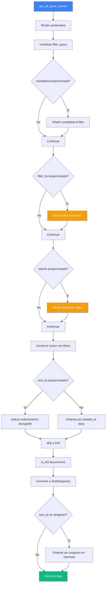
```mermaid
flowchart TD
    A[get_all_tasks_service] --> B[Recibir parámetros]
    B --> C[Inicializar filter_query]
    C --> D{completed proporcionado?}
    D -->|Sí| E[Añadir completed al filtro]
    D -->|No| F[Continuar]
    E --> F
    F --> G{filter_by proporcionado?}
    G -->|Sí| H[Aplicar filtro avanzado]
    G -->|No| I[Continuar]
    H --> I
    I --> J{search proporcionado?}
    J -->|Sí| K[Añadir búsqueda regex]
    J -->|No| L[Continuar]
    K --> L
    L --> M[Construir cursor con filtros]
    M --> N{sort_by proporcionado?}
    N -->|Sí| O[Aplicar ordenamiento MongoDB]
    N -->|No| P[Ordenar por created_at desc]
    O --> Q[skip y limit]
    P --> Q
    Q --> R[to_list documentos]
    R --> S[Convertir a TaskResponse]
    S --> T{sort_by es 'progress'?}
    T -->|Sí| U[Ordenar por progreso en memoria]
    T -->|No| V[Retornar lista]
    U --> V
    
    style A fill:#3b82f6,color:#fff
    style V fill:#10b981,color:#fff
    style H fill:#f59e0b,color:#fff
    style K fill:#f59e0b,color:#fff
```

##### `update_task_service(task_id: str, task_update: TaskUpdate) -> Optional[TaskResponse]`
**Descripción**: Actualiza una tarea existente. Solo actualiza los campos proporcionados.  
**Parámetros**:
- `task_id`: ID de la tarea a actualizar.
- `task_update`: Datos a actualizar (solo campos modificados).

**Retorna**: `TaskResponse` con la tarea actualizada o `None` si no se encuentra.

**Lanza**:
- `ValueError`: Si las fechas actualizadas no son válidas (endDateTime <= startDateTime).

**Efectos secundarios**:
- Actualiza el campo `updated_at` automáticamente.

> [!WARNING]
> Al actualizar subtareas, se reemplazan todas las subtareas existentes. Si solo quieres actualizar una subtarea específica, debes incluir todas las subtareas en la actualización.

**Diagrama de flujo**:

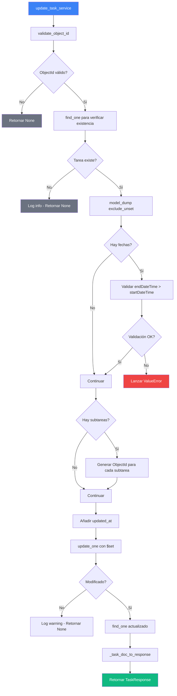
```mermaid
flowchart TD
    A[update_task_service] --> B[validate_object_id]
    B --> C{ObjectId válido?}
    C -->|No| D[Retornar None]
    C -->|Sí| E[find_one para verificar existencia]
    E --> F{Tarea existe?}
    F -->|No| G[Log info - Retornar None]
    F -->|Sí| H[model_dump exclude_unset]
    H --> I{Hay fechas?}
    I -->|Sí| J[Validar endDateTime > startDateTime]
    I -->|No| K[Continuar]
    J --> L{Validación OK?}
    L -->|No| M[Lanzar ValueError]
    L -->|Sí| K
    K --> N{Hay subtareas?}
    N -->|Sí| O[Generar ObjectId para cada subtarea]
    N -->|No| P[Continuar]
    O --> P
    P --> Q[Añadir updated_at]
    Q --> R[update_one con $set]
    R --> S{Modificado?}
    S -->|No| T[Log warning - Retornar None]
    S -->|Sí| U[find_one actualizado]
    U --> V[_task_doc_to_response]
    V --> W[Retornar TaskResponse]
    
    style A fill:#3b82f6,color:#fff
    style W fill:#10b981,color:#fff
    style M fill:#ef4444,color:#fff
    style D fill:#6b7280,color:#fff
    style G fill:#6b7280,color:#fff
```

##### `delete_task_service(task_id: str) -> bool`
**Descripción**: Elimina una tarea de la base de datos.  
**Parámetros**:
- `task_id`: ID de la tarea a eliminar.

**Retorna**: `True` si se eliminó correctamente, `False` si no se encontró.

**Diagrama de flujo**:

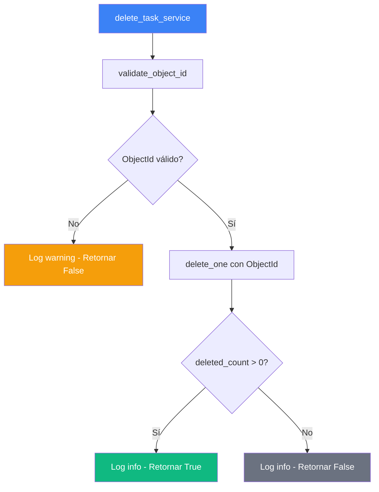
```mermaid
flowchart TD
    A[delete_task_service] --> B[validate_object_id]
    B --> C{ObjectId válido?}
    C -->|No| D[Log warning - Retornar False]
    C -->|Sí| E[delete_one con ObjectId]
    E --> F{deleted_count > 0?}
    F -->|Sí| G[Log info - Retornar True]
    F -->|No| H[Log info - Retornar False]
    
    style A fill:#3b82f6,color:#fff
    style G fill:#10b981,color:#fff
    style D fill:#f59e0b,color:#fff
    style H fill:#6b7280,color:#fff
```

---

### `app/api/ai.py`

**Descripción**: Rutas FastAPI para generación de tareas con IA usando Gemini.

#### Router

- **Prefijo**: `/ai`
- **Tags**: `["ai"]` (para documentación Swagger)

#### Endpoints

##### `POST /ai/generate-task`
**Descripción**: Genera una tarea estructurada usando IA basándose en el título y descripción.  
**Parámetros**:
- `payload: AITaskRequest`: Objeto con `title` (obligatorio) y `description` (opcional).

**Retorna**: `AITaskResponse` con la tarea estructurada (status 200).

**Lanza**:
- `HTTPException` (500): Si no se puede generar la tarea o `GEMINI_API_KEY` no está configurada.

**Diagrama de flujo**:

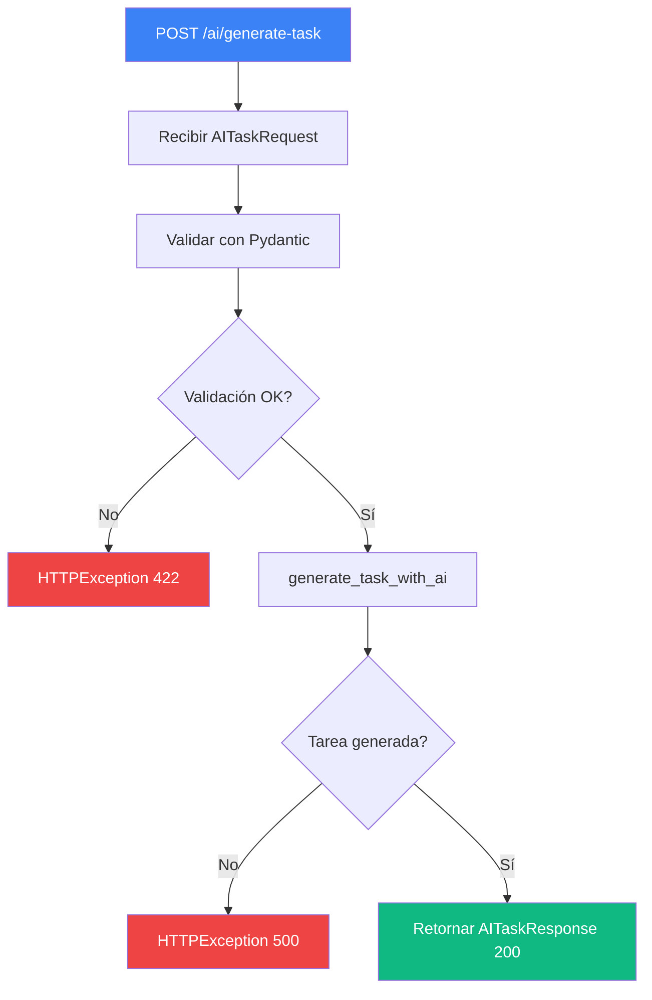
```mermaid
flowchart TD
    A[POST /ai/generate-task] --> B[Recibir AITaskRequest]
    B --> C[Validar con Pydantic]
    C --> D{Validación OK?}
    D -->|No| E[HTTPException 422]
    D -->|Sí| F[generate_task_with_ai]
    F --> G{Tarea generada?}
    G -->|No| H[HTTPException 500]
    G -->|Sí| I[Retornar AITaskResponse 200]
    
    style A fill:#3b82f6,color:#fff
    style I fill:#10b981,color:#fff
    style E fill:#ef4444,color:#fff
    style H fill:#ef4444,color:#fff
```

> [!NOTE]
> La IA analiza el título y descripción proporcionados y genera automáticamente:
> - Descripción detallada
> - Fechas de inicio y fin (ISO 8601)
> - Horas estimadas
> - Subtareas relacionadas (si la tarea es compleja)

**Diagrama de flujo**:

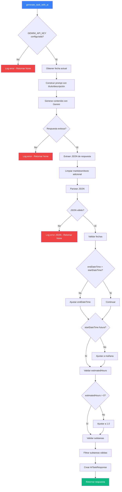
```mermaid
flowchart TD
    A[generate_task_with_ai] --> B{GEMINI_API_KEY configurada?}
    B -->|No| C[Log error - Retornar None]
    B -->|Sí| D[Obtener fecha actual]
    D --> E[Construir prompt con título/descripción]
    E --> F[Generar contenido con Gemini]
    F --> G{Respuesta exitosa?}
    G -->|No| H[Log error - Retornar None]
    G -->|Sí| I[Extraer JSON de respuesta]
    I --> J[Limpiar markdown/texto adicional]
    J --> K[Parsear JSON]
    K --> L{JSON válido?}
    L -->|No| M[Log error JSON - Retornar None]
    L -->|Sí| N[Validar fechas]
    N --> O{endDateTime > startDateTime?}
    O -->|No| P[Ajustar endDateTime]
    O -->|Sí| Q[Continuar]
    P --> R{startDateTime futura?}
    Q --> R
    R -->|No| S[Ajustar a mañana]
    R -->|Sí| T[Validar estimatedHours]
    S --> T
    T --> U{estimatedHours > 0?}
    U -->|No| V[Ajustar a 1.0]
    U -->|Sí| W[Validar subtareas]
    V --> W
    W --> X[Filtrar subtareas válidas]
    X --> Y[Crear AITaskResponse]
    Y --> Z[Retornar respuesta]
    
    style A fill:#3b82f6,color:#fff
    style Z fill:#10b981,color:#fff
    style C fill:#ef4444,color:#fff
    style H fill:#ef4444,color:#fff
    style M fill:#ef4444,color:#fff
```

---

### `app/api/tasks.py`

**Descripción**: Rutas FastAPI para la gestión de tareas. Esta capa solo se encarga de validar entrada, llamar a servicios y formatear respuestas. No contiene lógica de negocio.

#### Router

- **Prefijo**: `/tasks`
- **Tags**: `["tasks"]` (para documentación Swagger)

#### Endpoints

##### `POST /tasks/`
**Descripción**: Crea una nueva tarea.  
**Parámetros**:
- `payload: TaskCreate`: Datos de la tarea a crear (body).

**Retorna**: `TaskResponse` con la tarea creada (status 201).

**Lanza**:
- `HTTPException` (400): Si no se pudo crear la tarea.

**Diagrama de flujo**:

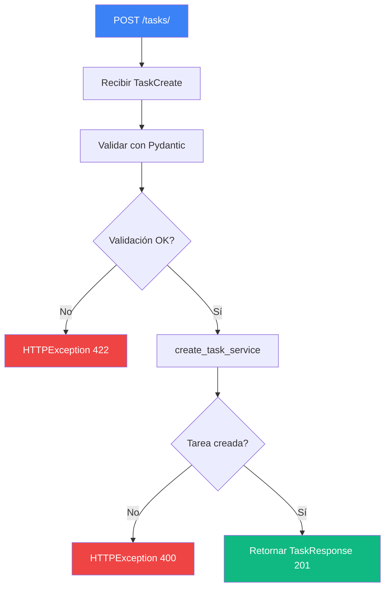
```mermaid
flowchart TD
    A[POST /tasks/] --> B[Recibir TaskCreate]
    B --> C[Validar con Pydantic]
    C --> D{Validación OK?}
    D -->|No| E[HTTPException 422]
    D -->|Sí| F[create_task_service]
    F --> G{Tarea creada?}
    G -->|No| H[HTTPException 400]
    G -->|Sí| I[Retornar TaskResponse 201]
    
    style A fill:#3b82f6,color:#fff
    style I fill:#10b981,color:#fff
    style E fill:#ef4444,color:#fff
    style H fill:#ef4444,color:#fff
```

##### `GET /tasks/{task_id}`
**Descripción**: Obtiene una tarea por su ID.  
**Parámetros**:
- `task_id: str`: ID de la tarea (path parameter).

**Retorna**: `TaskResponse` con la tarea (status 200).

**Lanza**:
- `HTTPException` (404): Si la tarea no se encuentra.

**Diagrama de flujo**:

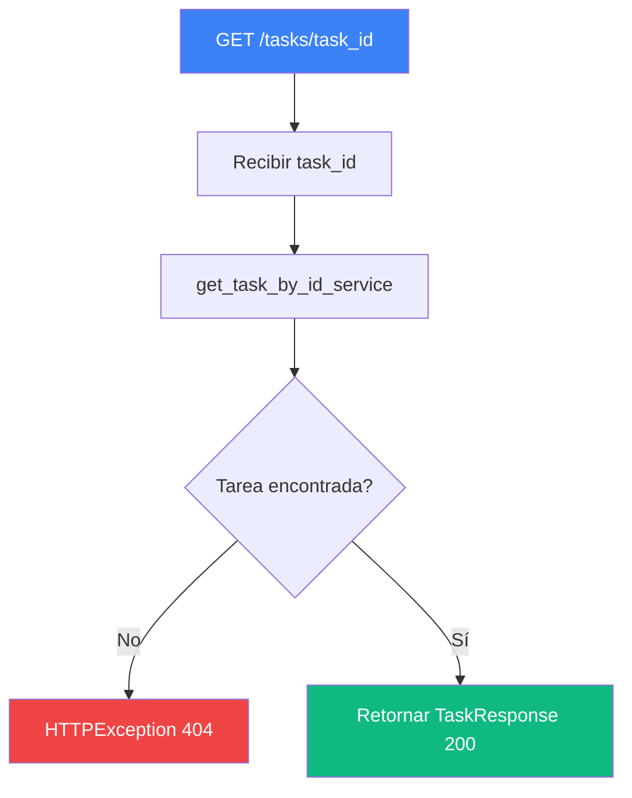
```mermaid
flowchart TD
    A[GET /tasks/task_id] --> B[Recibir task_id]
    B --> C[get_task_by_id_service]
    C --> D{Tarea encontrada?}
    D -->|No| E[HTTPException 404]
    D -->|Sí| F[Retornar TaskResponse 200]
    
    style A fill:#3b82f6,color:#fff
    style F fill:#10b981,color:#fff
    style E fill:#ef4444,color:#fff
```

##### `GET /tasks/`
**Descripción**: Obtiene todas las tareas con filtros opcionales, ordenamiento avanzado, búsqueda y paginación.  
**Query Parameters**:
- `completed: Optional[bool]`: Filtrar por estado de completado (compatibilidad con API anterior).
- `sortBy: Optional[str]`: Ordenamiento ('recent', 'oldest', 'dueDate', 'title', 'progress', 'duration').
- `filterBy: Optional[str]`: Filtro ('all', 'completed', 'inProgress', 'overdue', 'today').
- `search: Optional[str]`: Búsqueda de texto en título y descripción.
- `skip: int`: Número de documentos a saltar (mínimo: 0).
- `limit: int`: Número máximo de documentos (mínimo: 1, máximo: 1000).

**Retorna**: Lista de `TaskResponse` (status 200).

> [!TIP]
> Puedes combinar múltiples parámetros. Por ejemplo: `GET /tasks/?sortBy=dueDate&filterBy=inProgress&search=curso` para obtener tareas en progreso que contengan "curso", ordenadas por fecha de vencimiento.

**Diagrama de flujo**:

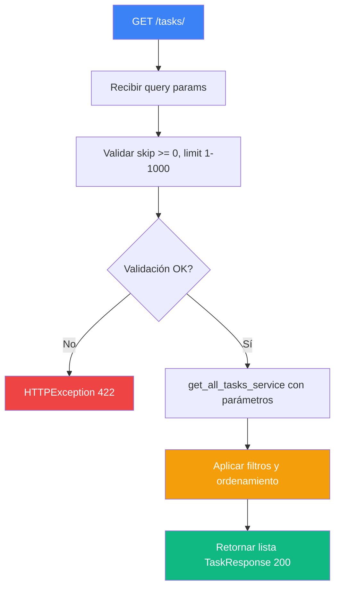
```mermaid
flowchart TD
    A[GET /tasks/] --> B[Recibir query params]
    B --> C[Validar skip >= 0, limit 1-1000]
    C --> D{Validación OK?}
    D -->|No| E[HTTPException 422]
    D -->|Sí| F[get_all_tasks_service con parámetros]
    F --> G[Aplicar filtros y ordenamiento]
    G --> H[Retornar lista TaskResponse 200]

    style A fill:#3b82f6,color:#fff
    style H fill:#10b981,color:#fff
    style E fill:#ef4444,color:#fff
    style G fill:#f59e0b,color:#fff
```

##### `PUT /tasks/{task_id}`
**Descripción**: Actualiza una tarea existente.  
**Parámetros**:
- `task_id: str`: ID de la tarea a actualizar (path parameter).
- `payload: TaskUpdate`: Datos a actualizar (body).

**Retorna**: `TaskResponse` con la tarea actualizada (status 200).

**Lanza**:
- `HTTPException` (404): Si la tarea no se encuentra o los datos son inválidos.

**Diagrama de flujo**:

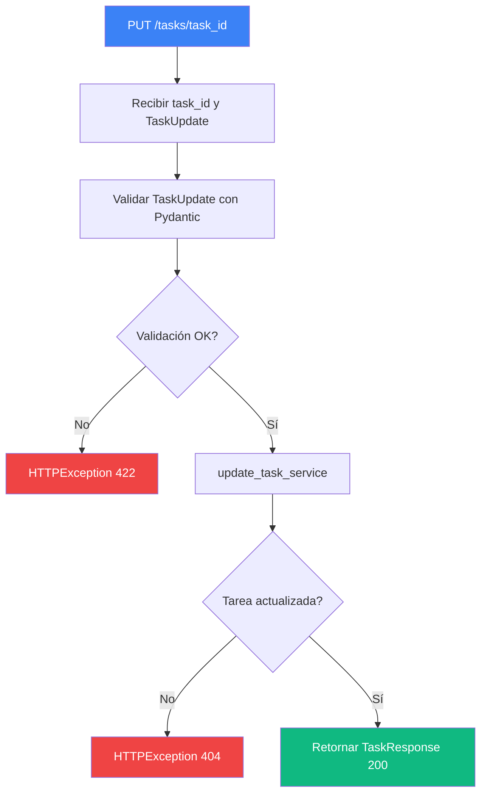
```mermaid
flowchart TD
    A[PUT /tasks/task_id] --> B[Recibir task_id y TaskUpdate]
    B --> C[Validar TaskUpdate con Pydantic]
    C --> D{Validación OK?}
    D -->|No| E[HTTPException 422]
    D -->|Sí| F[update_task_service]
    F --> G{Tarea actualizada?}
    G -->|No| H[HTTPException 404]
    G -->|Sí| I[Retornar TaskResponse 200]
    
    style A fill:#3b82f6,color:#fff
    style I fill:#10b981,color:#fff
    style E fill:#ef4444,color:#fff
    style H fill:#ef4444,color:#fff
```

##### `DELETE /tasks/{task_id}`
**Descripción**: Elimina una tarea.  
**Parámetros**:
- `task_id: str`: ID de la tarea a eliminar (path parameter).

**Retorna**: Sin contenido (status 204).

**Lanza**:
- `HTTPException` (404): Si la tarea no se encuentra.

**Diagrama de flujo**:

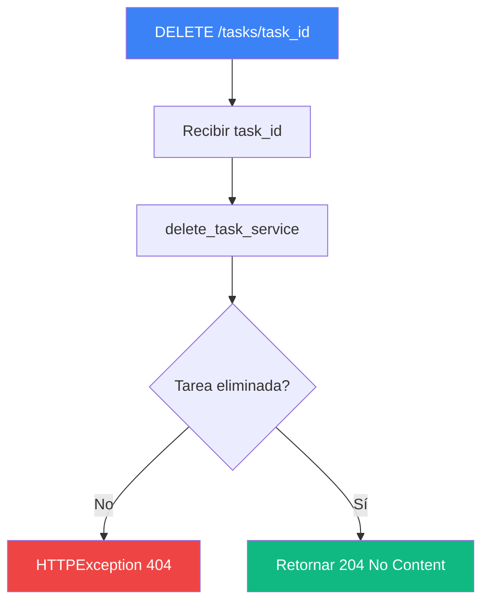
```mermaid
flowchart TD
    A[DELETE /tasks/task_id] --> B[Recibir task_id]
    B --> C[delete_task_service]
    C --> D{Tarea eliminada?}
    D -->|No| E[HTTPException 404]
    D -->|Sí| F[Retornar 204 No Content]
    
    style A fill:#3b82f6,color:#fff
    style F fill:#10b981,color:#fff
    style E fill:#ef4444,color:#fff
```

> [!TIP]
> Puedes probar todos los endpoints usando la documentación interactiva de Swagger en `/docs` cuando el servidor esté ejecutándose.

---

## Flujo de Datos

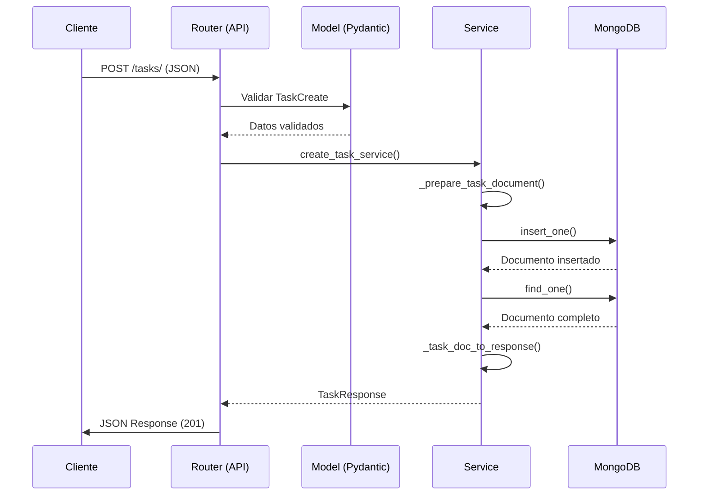
```mermaid
sequenceDiagram
    participant C as Cliente
    participant R as Router (API)
    participant M as Model (Pydantic)
    participant S as Service
    participant DB as MongoDB

    C->>R: POST /tasks/ (JSON)
    R->>M: Validar TaskCreate
    M-->>R: Datos validados
    R->>S: create_task_service()
    S->>S: _prepare_task_document()
    S->>DB: insert_one()
    DB-->>S: Documento insertado
    S->>DB: find_one()
    DB-->>S: Documento completo
    S->>S: _task_doc_to_response()
    S-->>R: TaskResponse
    R->>C: JSON Response (201)
```

---

## Configuración y Despliegue

### Requisitos Previos

- Python 3.10 o superior
- MongoDB instalado y ejecutándose localmente (puerto 27017 por defecto)

### Instalación

1. Crear entorno virtual:
```bash
python -m venv venv
source venv/bin/activate  # En Windows: venv\Scripts\activate
```

2. Instalar dependencias:
```bash
pip install -r requirements.txt
```

3. Verificar que MongoDB esté ejecutándose:
```bash
# En Linux/Mac
sudo systemctl start mongod

# O ejecutar manualmente
mongod
```

4. Ejecutar el servidor:
```bash
uvicorn main:app --reload --host 0.0.0.0 --port 8000
```

### Variables de Entorno

La aplicación utiliza un archivo `.env` para la configuración. Crea un archivo `.env` en el directorio `BackEnd` basándote en `.env.example`:

```bash
cp .env.example .env
```

Edita el archivo `.env` con tus valores:

```env
# Configuración de MongoDB
MONGODB_URL=mongodb://localhost:27017
DATABASE_NAME=intellitasker

# API Key de Gemini para generación de tareas con IA
```

**Variables disponibles**:
- `MONGODB_URL`: URL de conexión a MongoDB (por defecto: `mongodb://localhost:27017`)
- `DATABASE_NAME`: Nombre de la base de datos (por defecto: `intellitasker`)
- `GEMINI_API_KEY`: API Key de Google Gemini para generación de tareas con IA (requerida para funcionalidad de IA)

> [!IMPORTANT]
> El archivo `.env` no debe ser commiteado al repositorio. Asegúrate de que esté en `.gitignore`.

---

## Documentación Interactiva

Una vez que el servidor esté ejecutándose, puedes acceder a:

- **Swagger UI**: http://localhost:8000/docs

---

## Principios de Diseño

### Separación de Responsabilidades

- **Rutas (`app/api/`)**: Solo validan entrada y formatean salida.
- **Servicios (`app/services/`)**: Contienen toda la lógica de negocio y acceso a datos.
- **Modelos (`app/models/`)**: Definen esquemas de validación y serialización.

### Operaciones Asíncronas

Todas las operaciones de base de datos son asíncronas usando `async/await` y Motor.

### Manejo de ObjectId

- Los ObjectId nunca se exponen directamente al cliente.
- Se convierten automáticamente a strings en las respuestas.
- Se validan antes de realizar consultas.

### Validaciones

- Validación de tipos mediante Pydantic.
- Validación de fechas (endDateTime > startDateTime).
- Validación de rangos (horas estimadas > 0).
- Validación de formatos (ObjectId, fechas ISO 8601).

---

## Referencias

- [FastAPI Documentation](https://fastapi.tiangolo.com/)
- [Motor (MongoDB Async Driver)](https://motor.readthedocs.io/)
- [Pydantic Documentation](https://docs.pydantic.dev/)
- [MongoDB Documentation](https://www.mongodb.com/docs/)

---

## Licencia

Este documento está bajo la licencia [Creative Commons Attribution-NonCommercial-NoDerivatives 4.0 International](https://creativecommons.org/licenses/by-nc/4.0/deed.en).

