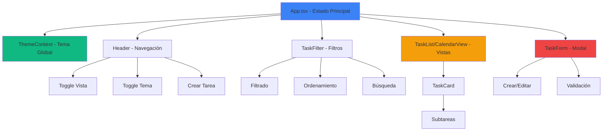
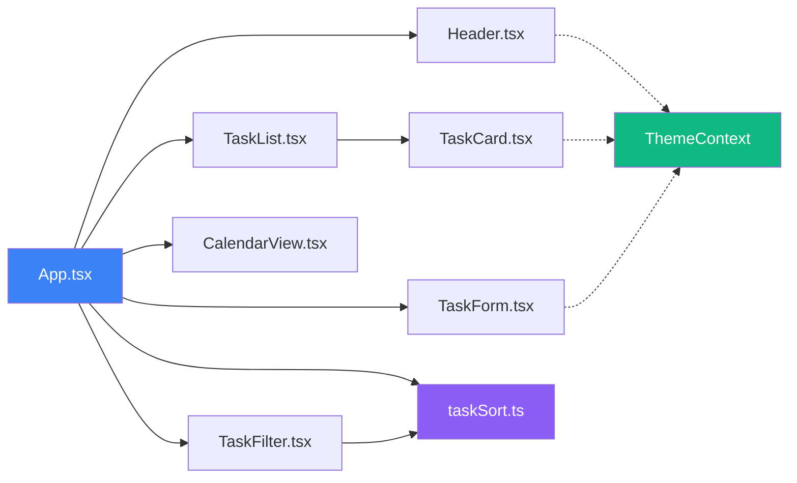

# Documentación del FrontEnd - IntelliTasker

## Descripción

Aplicación web desarrollada con React y TypeScript para gestionar tareas y proyectos. Ofrece una interfaz intuitiva con soporte para modo claro y oscuro, múltiples vistas (lista y calendario), y funcionalidades avanzadas de filtrado y ordenamiento.

> [!NOTE]
> Esta aplicación actualmente almacena las tareas en memoria. Los datos se perderán al recargar la página. La integración con Supabase está preparada para implementación futura.

---

## Tabla de Contenidos

1. [Tecnologías Utilizadas](#tecnologías-utilizadas)
2. [Arquitectura](#arquitectura)
3. [Estructura de Carpetas](#estructura-de-carpetas)
4. [Componentes Principales](#componentes-principales)
5. [Contextos](#contextos)
6. [Utilidades](#utilidades)
7. [Tipos TypeScript](#tipos-typescript)
8. [Configuración](#configuración)
9. [Scripts Disponibles](#scripts-disponibles)
10. [Guía de Desarrollo](#guía-de-desarrollo)
11. [Sistema de Diseño](#sistema-de-diseño)
12. [Referencias](#referencias)

---

## Tecnologías Utilizadas

### Core

- **React 18.3.1**: Biblioteca para construir interfaces de usuario
- **TypeScript 5.5.3**: Superset de JavaScript con tipado estático
- **Vite 5.4.2**: Build tool y servidor de desarrollo rápido
- **React Router DOM 7.9.6**: Enrutamiento para aplicaciones React

### Estilos

- **Tailwind CSS 3.4.1**: Framework de CSS utility-first
- **PostCSS 8.4.35**: Procesador de CSS
- **Autoprefixer 10.4.18**: Plugin de PostCSS para agregar prefijos de navegadores

### Iconos y UI

- **Lucide React 0.344.0**: Biblioteca de iconos

### Base de Datos (Preparado para integración)

- **Supabase JS 2.57.4**: Cliente JavaScript para Supabase (preparado para uso futuro)

### Desarrollo

- **ESLint 9.9.1**: Linter para JavaScript/TypeScript
- **TypeScript ESLint 8.3.0**: Reglas de ESLint para TypeScript

---

## Arquitectura

La aplicación sigue una arquitectura de componentes basada en React con las siguientes características:

- **Componentes Funcionales**: Todos los componentes utilizan funciones de React con Hooks
- **React Router**: Enrutamiento para navegación entre páginas
- **Manejo de Estado Local**: Usando `useState` para estado del componente
- **Context API**: Para compartir el tema entre componentes
- **Props y Callbacks**: Para comunicación entre componentes padre e hijo
- **Memoización**: Uso de `useMemo` para optimizar cálculos costosos

### Flujo de Datos



### Diagrama de Componentes



---

## Estructura de Carpetas

```
FrontEnd/
├── src/
│   ├── components/          # Componentes React
│   │   ├── CalendarView.tsx # Vista de calendario mensual
│   │   ├── Header.tsx       # Header principal con navegación
│   │   ├── Layout.tsx       # Layout compartido con Header
│   │   ├── TaskCard.tsx     # Tarjeta individual de tarea
│   │   ├── TaskFilter.tsx   # Filtros y ordenamiento
│   │   ├── TaskForm.tsx     # Formulario de crear/editar tarea
│   │   └── TaskList.tsx     # Lista de tareas
│   │
│   ├── pages/               # Páginas de la aplicación
│   │   └── HomePage.tsx     # Página principal
│   │
│   ├── context/             # Contextos de React
│   │   └── ThemeContext.tsx # Contexto del tema (claro/oscuro)
│   │
│   ├── types/               # Definiciones de tipos TypeScript
│   │   └── task.ts          # Tipos para Task y Subtask
│   │
│   ├── utils/               # Funciones utilitarias
│   │   └── taskSort.ts      # Funciones de ordenamiento y filtrado
│   │
│   ├── App.tsx              # Componente principal con Router
│   ├── main.tsx             # Punto de entrada de la aplicación
│   ├── index.css            # Estilos globales y Tailwind
│   └── vite-env.d.ts        # Tipos de Vite
│
├── index.html               # HTML principal
├── package.json             # Dependencias y scripts
├── vite.config.ts           # Configuración de Vite
├── tailwind.config.js       # Configuración de Tailwind
├── tsconfig.json            # Configuración de TypeScript
├── tsconfig.app.json        # Config de TS para la app
├── tsconfig.node.json       # Config de TS para Node
└── eslint.config.js         # Configuración de ESLint
```

---

## Componentes Principales

### App.tsx

**Descripción**: Componente raíz de la aplicación que configura React Router y el ThemeProvider.

**Responsabilidades**:
- Configura React Router para enrutamiento
- Proporciona ThemeProvider para toda la aplicación
- Define las rutas de la aplicación

**Rutas Configuradas**:
- `/`: Página principal (HomePage)

---

### HomePage.tsx

**Descripción**: Página principal de la aplicación que gestiona el estado global y coordina todos los componentes.

**Responsabilidades**:
- Gestiona el estado global de las tareas
- Controla la vista activa (lista o calendario)
- Maneja los filtros, ordenamiento y búsqueda
- Coordina la apertura/cierre del formulario de tareas

**Estado Principal**:

```typescript
- tasks: Task[]           // Lista de todas las tareas
- isFormOpen: boolean     // Estado del modal de formulario
- editingTask: Task | null // Tarea en edición
- view: 'list' | 'calendar' // Vista activa
- sortBy: SortOption      // Opción de ordenamiento
- filterBy: FilterOption  // Opción de filtro
- searchQuery: string     // Texto de búsqueda
```

**Funciones Clave**:

#### `handleCreateTask(task: Omit<Task, 'id'>): void`
**Descripción**: Crea una nueva tarea y la agrega al estado.  
**Parámetros**:
- `task`: Objeto de tarea sin el campo `id` (se genera automáticamente).  
**Retorna**: `void`  
**Efectos**: Actualiza el estado `tasks` y cierra el formulario.

#### `handleUpdateTask(updatedTask: Task): void`
**Descripción**: Actualiza una tarea existente en el estado.  
**Parámetros**:
- `updatedTask`: Tarea completa con los cambios aplicados.  
**Retorna**: `void`  
**Efectos**: Actualiza la tarea en el array `tasks` y cierra el formulario.

#### `handleDeleteTask(taskId: string): void`
**Descripción**: Elimina una tarea del estado.  
**Parámetros**:
- `taskId`: Identificador único de la tarea a eliminar.  
**Retorna**: `void`  
**Efectos**: Filtra la tarea del array `tasks`.

#### `handleEditTask(task: Task): void`
**Descripción**: Abre el formulario en modo edición con la tarea seleccionada.  
**Parámetros**:
- `task`: Tarea a editar.  
**Retorna**: `void`  
**Efectos**: Establece `editingTask` y abre el formulario.

> [!IMPORTANT]
> Los IDs de tareas se generan usando `Date.now().toString()`. Para producción, se recomienda usar UUIDs para evitar colisiones.

---

### Header.tsx

**Descripción**: Componente del encabezado de la aplicación con navegación y controles principales.

**Props**:

```typescript
interface HeaderProps {
  view: 'list' | 'calendar';
  onViewChange: (view: 'list' | 'calendar') => void;
  onCreateTask: () => void;
}
```

**Funcionalidades**:
- Muestra el título y subtítulo de la aplicación
- Toggle entre vista de lista y calendario
- Botón para cambiar tema (claro/oscuro)
- Botón para crear nueva tarea

**Ejemplo de uso**:

```typescript
<Header
  view={view}
  onViewChange={setView}
  onCreateTask={handleOpenForm}
/>
```

---

### TaskList.tsx

**Descripción**: Componente que muestra la lista de tareas en formato de grid.

**Props**:

```typescript
interface TaskListProps {
  tasks: Task[];
  onEditTask: (task: Task) => void;
  onDeleteTask: (taskId: string) => void;
  onUpdateTask: (task: Task) => void;
}
```

**Funcionalidades**:
- Renderiza un grid de tarjetas de tareas
- Muestra mensaje cuando no hay tareas
- Responsive: 1 columna en móvil, 2 en tablet, 3 en desktop

**Parámetros**:
- `tasks`: Array de tareas a mostrar.
- `onEditTask`: Callback que se ejecuta al hacer clic en editar.
- `onDeleteTask`: Callback que se ejecuta al eliminar una tarea.
- `onUpdateTask`: Callback que se ejecuta al actualizar una tarea.

---

### TaskCard.tsx

**Descripción**: Componente que representa una tarjeta individual de tarea con toda su información y controles.

**Props**:

```typescript
interface TaskCardProps {
  task: Task;
  onEdit: (task: Task) => void;
  onDelete: (taskId: string) => void;
  onUpdate: (task: Task) => void;
}
```

**Funcionalidades**:
- Muestra información de la tarea (título, descripción, fechas, horas)
- Para tareas sin subtareas: botón para marcar como completada
- Para tareas con subtareas: muestra progreso y permite expandir/colapsar
- Botones para editar y eliminar
- Indicador visual de completado (texto tachado)

**Estado Local**:
- `showSubtasks: boolean` - Controla la visibilidad de subtareas

**Funciones Internas**:

#### `toggleSubtask(subtaskId: string): void`
**Descripción**: Alterna el estado de completado de una subtarea.  
**Parámetros**:
- `subtaskId`: ID de la subtarea a alternar.  
**Retorna**: `void`  
**Efectos**: Actualiza la tarea mediante `onUpdate`.

#### `toggleTaskCompletion(): void`
**Descripción**: Alterna el estado de completado de una tarea sin subtareas.  
**Parámetros**: Ninguno  
**Retorna**: `void`  
**Efectos**: Actualiza la tarea mediante `onUpdate`.

> [!TIP]
> Las tareas con subtareas calculan su estado de completado dinámicamente basándose en si todas las subtareas están completadas.

---

### TaskForm.tsx

**Descripción**: Componente modal para crear o editar tareas con validación de campos.

**Props**:

```typescript
interface TaskFormProps {
  task: Task | null;  // null = crear nueva, Task = editar existente
  onSave: (task: Task | Omit<Task, 'id'>) => void;
  onClose: () => void;
}
```

**Campos del Formulario**:
- **Título** (requerido): Nombre de la tarea
- **Descripción**: Descripción detallada (opcional)
- **Fecha y hora de inicio** (requerido): Cuándo comienza la tarea
- **Fecha y hora de fin** (requerido): Cuándo termina la tarea
- **Tiempo estimado total** (requerido): Horas estimadas en total
- **Subtareas** (opcional):
  - Título de subtarea
  - Horas estimadas

**Funcionalidades**:
- Validación de campos requeridos
- Cálculo y visualización del total de horas de subtareas
- Agregar/eliminar subtareas dinámicamente
- Modo crear vs. modo editar
- Botón de IA para generar tarea automáticamente usando Gemini

**Funciones Principales**:

#### `handleAddSubtask(): void`
**Descripción**: Agrega una nueva subtarea al formulario.  
**Parámetros**: Ninguno  
**Retorna**: `void`  
**Efectos**: Agrega una subtarea al estado local `subtasks`.

#### `handleRemoveSubtask(subtaskId: string): void`
**Descripción**: Elimina una subtarea del formulario.  
**Parámetros**:
- `subtaskId`: ID de la subtarea a eliminar.  
**Retorna**: `void`  
**Efectos**: Filtra la subtarea del array `subtasks`.

#### `handleSubmit(e: React.FormEvent): void`
**Descripción**: Valida y envía el formulario.  
**Parámetros**:
- `e`: Evento del formulario.  
**Retorna**: `void`  
**Lanza**: Previene el envío si hay errores de validación.  
**Efectos**: Llama a `onSave` con los datos del formulario.

#### `handleGenerateWithAI(): Promise<void>`
**Descripción**: Genera una tarea estructurada usando IA (Gemini) basándose en el título y descripción.  
**Parámetros**: Ninguno  
**Retorna**: `Promise<void>`  
**Efectos**: 
- Llama al endpoint `/ai/generate-task` del backend
- Rellena automáticamente los campos del formulario con los datos generados
- Genera subtareas si la tarea es compleja

> [!WARNING]
> El formulario valida que la fecha de fin sea posterior a la fecha de inicio. Si no se cumple, no se permite guardar.

> [!NOTE]
> El botón de IA solo está habilitado cuando hay un título ingresado. Muestra un tooltip "IA" al hacer hover.

---

### TaskFilter.tsx

**Descripción**: Componente para filtrar, ordenar y buscar tareas con estadísticas en tiempo real.

**Props**:

```typescript
interface TaskFilterProps {
  tasks: Task[];
  sortBy: SortOption;
  filterBy: FilterOption;
  onSortChange: (sort: SortOption) => void;
  onFilterChange: (filter: FilterOption) => void;
  onSearch: (query: string) => void;
  searchQuery: string;
}
```

**Funcionalidades**:

#### Búsqueda
- Por título o descripción
- Búsqueda en tiempo real mientras se escribe

#### Ordenamiento
- **Más recientes primero**: Por fecha de inicio descendente
- **Más antiguas primero**: Por fecha de inicio ascendente
- **Por fecha de vencimiento**: Por fecha de fin ascendente
- **Por título (A-Z)**: Orden alfabético
- **Por progreso**: Mayor progreso primero
- **Por duración**: Mayor duración primero

#### Filtros
- **Todas las tareas**: Sin filtro
- **Para hoy**: Tareas que ocurren hoy
- **En progreso**: Tareas no completadas
- **Completadas**: Tareas completadas
- **Vencidas**: Tareas cuya fecha de fin ha pasado

#### Estadísticas
Muestra contadores en tiempo real:
- Total de tareas
- Completadas
- En progreso
- Vencidas

---

### CalendarView.tsx

**Descripción**: Componente de vista de calendario mensual con navegación entre meses.

**Props**:

```typescript
interface CalendarViewProps {
  tasks: Task[];
  onTaskClick: (task: Task) => void;
}
```

**Funcionalidades**:
- Vista mensual con navegación entre meses
- Muestra tareas que ocurren en cada día
- Diferencia visual entre tareas completadas y en progreso
- Resalta el día actual
- Click en tarea para editarla
- Leyenda de colores en la parte inferior

**Estado Local**:
- `currentDate: Date` - Mes actualmente visible

**Funciones Principales**:

#### `goToPreviousMonth(): void`
**Descripción**: Navega al mes anterior.  
**Parámetros**: Ninguno  
**Retorna**: `void`  
**Efectos**: Actualiza `currentDate` al mes anterior.

#### `goToNextMonth(): void`
**Descripción**: Navega al mes siguiente.  
**Parámetros**: Ninguno  
**Retorna**: `void`  
**Efectos**: Actualiza `currentDate` al mes siguiente.

#### `goToToday(): void`
**Descripción**: Navega al mes actual.  
**Parámetros**: Ninguno  
**Retorna**: `void`  
**Efectos**: Establece `currentDate` a la fecha actual.

---

## Contextos

### ThemeContext.tsx

**Descripción**: Contexto para gestionar el tema (claro/oscuro) de la aplicación con persistencia en localStorage.

**Funcionalidades**:
- Almacena el tema actual ('light' | 'dark')
- Persiste la preferencia en localStorage
- Detecta preferencia del sistema operativo al iniciar
- Aplica clase 'dark' al elemento raíz del documento
- Hook `useTheme()` para acceder al tema desde cualquier componente

**API**:

```typescript
const { theme, toggleTheme } = useTheme();
// theme: 'light' | 'dark'
// toggleTheme: () => void
```

**Componentes**:

#### `ThemeProvider({ children }: { children: ReactNode }): JSX.Element`
**Descripción**: Proveedor del contexto de tema que envuelve la aplicación.  
**Parámetros**:
- `children`: Componentes hijos que tendrán acceso al contexto.  
**Retorna**: JSX.Element con el proveedor del contexto.  
**Efectos**: 
- Inicializa el tema desde localStorage o preferencia del sistema
- Aplica la clase 'dark' al documento cuando cambia el tema
- Persiste el tema en localStorage

#### `useTheme(): ThemeContextType`
**Descripción**: Hook personalizado para acceder al contexto de tema.  
**Parámetros**: Ninguno  
**Retorna**: Objeto con `theme` y `toggleTheme`.  
**Lanza**: Error si se usa fuera de `ThemeProvider`.

**Ejemplo de uso**:

```typescript
import { useTheme } from '../context/ThemeContext';

function MyComponent() {
  const { theme, toggleTheme } = useTheme();
  const isDark = theme === 'dark';

  return (
    <div className={isDark ? 'bg-slate-800' : 'bg-white'}>
      <button onClick={toggleTheme}>
        Cambiar a {isDark ? 'claro' : 'oscuro'}
      </button>
    </div>
  );
}
```

> [!NOTE]
> El tema se persiste en `localStorage` con la clave `'theme'`. Si no hay preferencia guardada, se detecta automáticamente la preferencia del sistema operativo.

---

## Utilidades

### taskSort.ts

**Descripción**: Utilidades para ordenar y filtrar tareas con lógica inteligente para tareas con y sin subtareas.

#### Tipos Exportados

```typescript
export type SortOption = 'recent' | 'oldest' | 'dueDate' | 'title' | 'progress' | 'duration';
export type FilterOption = 'all' | 'completed' | 'inProgress' | 'overdue' | 'today';
```

#### Funciones Exportadas

##### `sortTasks(tasks: Task[], sortBy: SortOption): Task[]`
**Descripción**: Ordena un array de tareas según la opción especificada.  
**Parámetros**:
- `tasks`: Array de tareas a ordenar.
- `sortBy`: Opción de ordenamiento ('recent', 'oldest', 'dueDate', 'title', 'progress', 'duration').  
**Retorna**: Nuevo array de tareas ordenadas (no muta el original).  
**Comportamiento**:
- `'recent'`: Ordena por fecha de inicio descendente (más recientes primero)
- `'oldest'`: Ordena por fecha de inicio ascendente (más antiguas primero)
- `'dueDate'`: Ordena por fecha de fin ascendente (próximas a vencer primero)
- `'title'`: Ordena alfabéticamente por título (locale: 'es')
- `'progress'`: Ordena por porcentaje de progreso descendente
- `'duration'`: Ordena por horas estimadas descendente

**Ejemplo**:

```typescript
import { sortTasks } from './utils/taskSort';

const sortedTasks = sortTasks(tasks, 'recent');
```

##### `filterTasks(tasks: Task[], filterBy: FilterOption): Task[]`
**Descripción**: Filtra tareas según el criterio especificado con lógica inteligente.  
**Parámetros**:
- `tasks`: Array de tareas a filtrar.
- `filterBy`: Opción de filtro ('all', 'completed', 'inProgress', 'overdue', 'today').  
**Retorna**: Nuevo array de tareas filtradas.  
**Lógica**:
- **Tareas sin subtareas**: Usa el campo `completed` directamente
- **Tareas con subtareas**: Verifica si todas las subtareas están completadas
- `'today'`: Filtra tareas que ocurren en el día actual
- `'overdue'`: Filtra tareas cuya fecha de fin ha pasado

**Ejemplo**:

```typescript
import { filterTasks } from './utils/taskSort';

const completedTasks = filterTasks(tasks, 'completed');
```

##### `getTaskStats(tasks: Task[]): { total: number, completed: number, inProgress: number, overdue: number }`
**Descripción**: Calcula estadísticas de un conjunto de tareas.  
**Parámetros**:
- `tasks`: Array de tareas a analizar.  
**Retorna**: Objeto con contadores:
- `total`: Número total de tareas
- `completed`: Número de tareas completadas
- `inProgress`: Número de tareas en progreso
- `overdue`: Número de tareas vencidas

**Ejemplo**:

```typescript
import { getTaskStats } from './utils/taskSort';

const stats = getTaskStats(tasks);
console.log(`Total: ${stats.total}, Completadas: ${stats.completed}`);
```

> [!IMPORTANT]
> La lógica de completado es inteligente: para tareas con subtareas, se considera completada solo si todas las subtareas están completadas. Para tareas sin subtareas, se usa el campo `completed` directamente.

---

## Tipos TypeScript

### task.ts

**Descripción**: Definiciones de tipos TypeScript para tareas y subtareas.

#### `Subtask`

```typescript
export interface Subtask {
  id: string;
  title: string;
  estimatedHours: number;
  completed: boolean;
}
```

**Campos**:
- `id`: Identificador único de la subtarea (string)
- `title`: Título de la subtarea (string)
- `estimatedHours`: Horas estimadas para completar (number)
- `completed`: Estado de completado (boolean)

#### `Task`

```typescript
export interface Task {
  id: string;
  title: string;
  description: string;
  startDateTime: string;      // ISO 8601 format
  endDateTime: string;         // ISO 8601 format
  estimatedHours: number;
  completed: boolean;          // Solo para tareas sin subtareas
  subtasks: Subtask[];
}
```

**Campos**:
- `id`: Identificador único de la tarea (string)
- `title`: Título de la tarea (string, requerido)
- `description`: Descripción detallada (string, opcional)
- `startDateTime`: Fecha y hora de inicio en formato ISO 8601 (string)
- `endDateTime`: Fecha y hora de fin en formato ISO 8601 (string)
- `estimatedHours`: Horas estimadas totales (number)
- `completed`: Estado de completado, solo usado para tareas sin subtareas (boolean)
- `subtasks`: Array de subtareas (Subtask[])

> [!NOTE]
> Las fechas se almacenan como strings en formato ISO 8601. El campo `completed` en Task se usa solo para tareas sin subtareas. Para tareas con subtareas, el estado de completado se calcula dinámicamente verificando si todas las subtareas están completadas.

**Ejemplo de uso**:

```typescript
import { Task, Subtask } from './types/task';

const subtask: Subtask = {
  id: '1',
  title: 'Diseñar mockups',
  estimatedHours: 4,
  completed: false
};

const task: Task = {
  id: '1',
  title: 'Crear landing page',
  description: 'Diseñar y desarrollar la landing page',
  startDateTime: '2025-01-15T09:00:00',
  endDateTime: '2025-01-20T18:00:00',
  estimatedHours: 40,
  completed: false,
  subtasks: [subtask]
};
```

---

## Configuración

### Vite (vite.config.ts)

**Descripción**: Configuración del build tool Vite para desarrollo y producción.

```typescript
import { defineConfig } from 'vite';
import react from '@vitejs/plugin-react';

export default defineConfig({
  plugins: [react()],
  optimizeDeps: {
    exclude: ['lucide-react']  // Excluido para optimización
  }
});
```

**Características**:
- Plugin de React habilitado
- Optimización de dependencias con exclusión de `lucide-react`

### Tailwind (tailwind.config.js)

**Descripción**: Configuración del framework CSS Tailwind con breakpoints y tamaños personalizados.

**Breakpoints personalizados**:
- `xs: 480px`: Móviles muy pequeños
- `sm: 640px`: Móviles estándar
- `md: 768px`: Tablets
- `lg: 1024px`: Laptops
- `xl: 1280px`: Desktops
- `2xl: 1536px`: TVs y pantallas grandes
- `3xl: 1920px`: TVs 4K o pantallas ultra anchas

**Tamaños de fuente personalizados**:
- `xs` a `4xl`: Con line-height optimizado

**Espaciado adicional**:
- `72`, `84`, `96`: Espaciado adicional para layouts complejos

**Configuración**:
- `content`: Archivos donde Tailwind buscará clases
- `theme.extend`: Extensiones personalizadas del tema con breakpoints y tamaños

### TypeScript

**Descripción**: Configuración de TypeScript con múltiples archivos de configuración.

**Archivos**:
- **tsconfig.app.json**: Configuración para código de la aplicación
- **tsconfig.node.json**: Configuración para scripts de Node (Vite)
- **tsconfig.json**: Proyecto de referencias para ambos

**Características habilitadas**:
- Strict mode activado
- ES2020 target
- JSX: react-jsx
- Module resolution: bundler

### ESLint

**Descripción**: Configuración del linter ESLint con reglas para TypeScript y React.

**Características**:
- Configuración estricta con TypeScript ESLint
- Reglas para React Hooks
- Reglas para React Refresh

---

## Scripts Disponibles

### Desarrollo

```bash
npm run dev
# o
pnpm dev
```

**Descripción**: Inicia el servidor de desarrollo con Vite en modo hot-reload.  
**Puerto por defecto**: 5173  
**Características**: Recarga automática al guardar cambios.

### Build de Producción

```bash
npm run build
# o
pnpm build
```

**Descripción**: Genera los archivos optimizados para producción.  
**Salida**: Carpeta `dist/` con archivos minificados y optimizados.

### Preview de Producción

```bash
npm run preview
# o
pnpm preview
```

**Descripción**: Sirve los archivos de producción localmente para pruebas antes de desplegar.

### Linting

```bash
npm run lint
# o
pnpm lint
```

**Descripción**: Ejecuta ESLint para verificar errores de código y estilo.

### Type Checking

```bash
npm run typecheck
# o
pnpm typecheck
```

**Descripción**: Verifica tipos TypeScript sin generar archivos. Útil para CI/CD.

---

## Guía de Desarrollo

### Agregar un Nuevo Componente

1. Crear archivo en `src/components/NombreComponente.tsx`:

```typescript
import { useTheme } from '../context/ThemeContext';

interface NombreComponenteProps {
  // Props aquí
  prop1: string;
  prop2?: number;
}

function NombreComponente({ prop1, prop2 }: NombreComponenteProps) {
  const { theme } = useTheme();
  const isDark = theme === 'dark';

  return (
    <div className={isDark ? 'bg-slate-800 text-white' : 'bg-white text-slate-900'}>
      {/* Contenido */}
    </div>
  );
}

export default NombreComponente;
```

2. Importar y usar en el componente padre:

```typescript
import NombreComponente from './components/NombreComponente';

function App() {
  return <NombreComponente prop1="valor" />;
}
```

### Agregar una Nueva Utilidad

1. Crear archivo en `src/utils/nombreUtilidad.ts`
2. Exportar funciones con tipos TypeScript apropiados
3. Importar donde se necesite

**Ejemplo**:

```typescript
// src/utils/dateUtils.ts
export function formatDate(date: Date): string {
  return date.toLocaleDateString('es-ES');
}

// Uso
import { formatDate } from './utils/dateUtils';
const formatted = formatDate(new Date());
```

### Manejo de Temas

Para soportar modo oscuro en un componente:

```typescript
import { useTheme } from '../context/ThemeContext';

function MyComponent() {
  const { theme } = useTheme();
  const isDark = theme === 'dark';

  return (
    <div className={`${isDark ? 'bg-slate-800 text-white' : 'bg-white text-slate-900'}`}>
      Contenido
    </div>
  );
}
```

### Formateo de Fechas

Las fechas se almacenan como strings ISO 8601. Para formatearlas:

```typescript
const formatDateTime = (dateTime: string) => {
  const date = new Date(dateTime);
  return date.toLocaleDateString('es-ES', { 
    day: '2-digit', 
    month: 'short', 
    hour: '2-digit', 
    minute: '2-digit' 
  });
};
```

### Estilos CSS Personalizados

Agregar estilos en `src/index.css`:

```css
@tailwind base;
@tailwind components;
@tailwind utilities;

/* Tus estilos personalizados aquí */
.mi-clase-personalizada {
  /* ... */
}
```

> [!TIP]
> Prefiere usar clases de Tailwind sobre CSS personalizado. Solo usa CSS personalizado cuando Tailwind no cubre tu caso de uso.

---

## Sistema de Diseño

### Paleta de Colores

**Modo Claro**:
- Fondo principal: `slate-50` a `slate-100` (gradiente)
- Tarjetas: `white`
- Texto principal: `slate-900`
- Texto secundario: `slate-600`
- Bordes: `slate-200` a `slate-300`

**Modo Oscuro**:
- Fondo principal: `slate-950`
- Tarjetas: `slate-800`
- Texto principal: `white`
- Texto secundario: `slate-400`
- Bordes: `slate-700`

**Colores de Estado**:
- Completado: `green-600`
- En progreso: `blue-600`
- Vencido: `red-600`
- Acción primaria: `blue-600`

### Tipografía

- Fuente del sistema (sans-serif por defecto)
- Tamaños: `text-xs`, `text-sm`, `text-base`, `text-lg`, `text-xl`, `text-2xl`, `text-3xl`
- Pesos: `font-medium`, `font-semibold`, `font-bold`

### Espaciado

- Usa el sistema de espaciado de Tailwind (0.25rem, 0.5rem, 1rem, etc.)
- Padding común: `p-4`, `p-5`, `p-6`
- Gap común: `gap-3`, `gap-4`, `gap-6`

---

## Dependencias Principales

### Producción

- `react` / `react-dom`: Framework UI
- `lucide-react`: Iconos
- `@supabase/supabase-js`: Cliente Supabase (preparado para uso futuro)

### Desarrollo

- `vite`: Build tool
- `@vitejs/plugin-react`: Plugin React para Vite
- `typescript`: Tipado estático
- `tailwindcss`: Estilos
- `eslint`: Linting
- `autoprefixer` / `postcss`: Procesamiento CSS

---

## Funcionalidades Futuras

### Preparadas para Implementación

- Integración con Supabase (cliente ya instalado)
- Persistencia de datos en base de datos
- Autenticación de usuarios
- Sincronización en tiempo real

### Mejoras Sugeridas

- Arrastrar y soltar para reorganizar tareas
- Notificaciones de tareas vencidas
- Exportar/importar tareas (JSON, CSV)
- Compartir tareas con otros usuarios
- Vista de semana en el calendario
- Búsqueda avanzada con múltiples criterios
- Etiquetas/categorías para tareas
- Modo de vista compacta

---

## Notas Importantes

> [!WARNING]
> **Persistencia**: Actualmente las tareas se almacenan solo en memoria. Se perderán al recargar la página. Implementa la integración con Supabase para persistencia permanente.

> [!NOTE]
> **IDs de Tareas**: Se generan usando `Date.now().toString()`. Para producción, considerar usar UUIDs para evitar colisiones en sistemas distribuidos.

> [!IMPORTANT]
> **Fechas**: Se usan strings ISO 8601. Asegurarse de que los inputs `datetime-local` proporcionen este formato correctamente.

> [!TIP]
> **Modo Oscuro**: El tema se persiste en `localStorage` con la clave `'theme'`. Se detecta automáticamente la preferencia del sistema al iniciar.

> [!NOTE]
> **Responsive**: La aplicación está optimizada para móvil, tablet y desktop usando Tailwind's responsive breakpoints (sm, md, lg, xl).

---

## Troubleshooting

### Los estilos no se aplican

**Problema**: Las clases de Tailwind no se están aplicando.

**Soluciones**:
- Verificar que Tailwind esté configurado correctamente
- Revisar que las clases estén incluidas en `tailwind.config.js` content
- Asegurarse de que `index.css` importe las directivas de Tailwind
- Reiniciar el servidor de desarrollo

### El tema oscuro no funciona

**Problema**: El modo oscuro no se aplica correctamente.

**Soluciones**:
- Verificar que `ThemeContext` esté envolviendo la app en `main.tsx`
- Revisar que `document.documentElement.classList` tenga la clase 'dark'
- Limpiar localStorage y recargar la página
- Verificar que las clases de Tailwind incluyan variantes `dark:`

### Los tipos TypeScript dan error

**Problema**: Errores de tipos en el código.

**Soluciones**:
- Ejecutar `npm run typecheck` para ver errores detallados
- Verificar que los tipos estén correctamente importados
- Asegurarse de que `tsconfig.json` esté configurado correctamente
- Revisar que las dependencias de tipos estén instaladas (`@types/react`, etc.)

### El formulario no valida correctamente

**Problema**: El formulario permite guardar datos inválidos.

**Soluciones**:
- Verificar que todos los campos requeridos tengan validación
- Revisar que la fecha de fin sea posterior a la fecha de inicio
- Asegurarse de que los valores numéricos sean positivos

---

## Referencias

- [Documentación de React](https://react.dev/)
- [Documentación de TypeScript](https://www.typescriptlang.org/docs/)
- [Documentación de Vite](https://vitejs.dev/)
- [Documentación de Tailwind CSS](https://tailwindcss.com/docs)
- [Lucide Icons](https://lucide.dev/)
- [Supabase Documentation](https://supabase.com/docs)
- [React Hooks Documentation](https://react.dev/reference/react)

---

## Licencia

Este documento está bajo la licencia [Creative Commons Attribution-NonCommercial-NoDerivatives 4.0 International](https://creativecommons.org/licenses/by-nc-nd/4.0/deed.es).

---

**Última actualización**: 2025  
**Versión**: 0.0.1 (Desarrollo)
